## Abstract {.unnumbered} 

```{python}
#|include: false
import json
from pathlib import Path
import pandas as pd
import numpy as np
import matplotlib.pyplot as plt
import json
import dask.dataframe as dd
import statsmodels.api as sm
import pickle
import sys 
sys.path.append("code/Python")
from numeric import convert_to_percent, logistic
from results_misc import cycles
from reporting import (
    ROUND_DIGITS,
    create_95_CI,
    create_95_CI_mean_se,
    create_95_CI_percents,
    create_95_CI_percents_mean_se,
    format_percent,
    format_value_and_se,
    format_p_value
)
np.set_printoptions(legacy='1.25')

folder = 'final_cohort'

with open(f"results/{folder}/cohort_outcomes/standard/race_group_hetero_RA.pkl", "rb") as f:
    standard_race_hetero_ra_dict = pickle.load(f)
with open(f"results/{folder}/cohort_outcomes/standard/race_group_hetero_NR.pkl", "rb") as f:
    standard_race_hetero_nr_dict = pickle.load(f)

with open(f"results/{folder}/cohort_outcomes/standard/race_group_nohetero_RA.pkl", "rb") as f:
    standard_race_nohetero_ra_dict = pickle.load(f)
with open(f"results/{folder}/cohort_outcomes/standard/race_group_nohetero_NR.pkl", "rb") as f:
    standard_race_nohetero_nr_dict = pickle.load(f)

```

**Objective:** To estimate the impact of removing race-adjusted antihypertensive treatment recommendations for Black adults on health outcomes, healthcare utilization, and racial/ethnic disparities.  

**Materials and methods:** A discrete-time state-transition microsimulation model of hypertension natural history and health system utilization was developed to simulate lifetime trajectories among a cohort of 100,000 non-Hispanic Black and non-Hispanic white 40-year-old adults. We evaluated the effect of removing race-adjusted antihypertensive treatment recommendations under two scenarios: one assuming racial heterogeneity in treatment effectiveness, reflecting evidence behind prior race-specific guidelines, and the other assuming no racial heterogeneity. Our main outcomes included life expectancy, cumulative incidence and duration of hypertension, and blood pressure control with antihypertensive treatment.

**Results:** Under assumptions of heterogeneous treatment effectiveness by race, guidelines without race adjustment decreased life expectancy among non-Hispanic Black adults by `{python} round(standard_race_hetero_nr_dict['Difference']['years_to_death'][0] - standard_race_hetero_ra_dict['Difference']['years_to_death'][0], ROUND_DIGITS)` years, increasing the life expectancy gap with non-Hispanic white adults from `{python} round(standard_race_hetero_ra_dict['Difference']['years_to_death'][0], ROUND_DIGITS)` to `{python} round(standard_race_hetero_nr_dict['Difference']['years_to_death'][0], ROUND_DIGITS)` years. Hypertension control among non-Hispanic Black adults also worsened. Years with uncontrolled hypertension increased by `{python} -(round(standard_race_hetero_nr_dict['Difference']['years_sick_treated'][0] - standard_race_hetero_ra_dict['Difference']['years_sick_treated'][0], ROUND_DIGITS))` years, widening the disparity with non-Hispanic white adults from `{python} -round(standard_race_hetero_ra_dict['Difference']['years_sick_treated'][0], ROUND_DIGITS)` to `{python} -round(standard_race_hetero_nr_dict['Difference']['years_sick_treated'][0], ROUND_DIGITS)` years. Assuming no racial heterogeneity, these effects were diminished: life expectancy decreased by `{python} round(standard_race_nohetero_nr_dict['Difference']['years_to_death'][0] - standard_race_nohetero_ra_dict['Difference']['years_to_death'][0], ROUND_DIGITS)` years and years with uncontrolled hypertension increased by `{python} -(round(standard_race_nohetero_nr_dict['Difference']['years_sick_treated'][0] - standard_race_nohetero_ra_dict['Difference']['years_sick_treated'][0], ROUND_DIGITS))` years, one-half and one-quarter of the effects observed under assumptions of heterogeneous treatment effectiveness by race. 

**Discussion:** The potential effects of removing race-adjusted antihypertensive treatment guidelines depended on assumptions of racial heterogeneity in treatment effectiveness.

**Conclusion:** Our findings highlight the importance of understanding drivers of previously observed racial differences before modifying antihypertensive treatment guidelines.

**Word count:** 3,446 words

## Background and significance
Hypertension affects nearly half of American adults and is a major driver of cardiovascular mortality in the U.S.[@navar2016temporal] The burden of hypertension is not shared equally across the population. Non-Hispanic Black adults have a higher prevalence of hypertension compared with non-Hispanic white, non-Hispanic Asian, and Hispanic adults.[@aggarwal2021racial; @muntner2018potential] Furthermore, only one in four adults with hypertension achieve recommended blood pressure targets,[@cdc2023million] and rates of blood pressure control are lower among non-Hispanic Black, Hispanic, and non-Hispanic Asian adults compared with non-Hispanic white adults.[@muntner2020trends] Previous research suggests that variation in hypertension control is shaped by socioeconomic factors, including income, insurance status, or educational attainment.[@cdc2023million;@muntner2020trends]

Most adults with hypertension are advised to make lifestyle modifications and initiate antihypertensive treatment to lower blood pressure and reduce the risk of cardiovascular events.[@cdc2023million;@whelton20182017] The Antihypertensive and Lipid-Lowering Treatment to Prevent Heart Attack Trial (ALLHAT), conducted between 1994 and 2002, compared antihypertensive medication classes in preventing major cardiovascular events. Subgroup analyses from ALLHAT revealed heterogeneity in antihypertensive treatment effectiveness between Black and non-Black adults.[@wright2005outcomes;@leenen2006clinical;@wright2008clinical] These findings informed race-specific pharmacologic therapy recommendations for Black adults in major clinical practice guidelines, such as the 2014 Eighth Joint National Committee, 2017 American College of Cardiology (ACC)/American Heart Association (AHA), and 2018 European Society of Cardiology guidelines.[@whelton20182017;@james20142014;@williams20182018]

However, the inclusion of race in clinical algorithms and practice guidelines has faced growing criticism for propagating racial bias in clinical decision-making and exacerbating health disparities.[@vyas2020hidden; @cerdena2020race; @neal2021racial] In response, national organizations have removed race or ethnicity-based adjustments from some clinical equations.[@wright2022eliminating;@borrell2021race; @inker2021new; @khan2024development; @ndumele2025role] Recently, the 2025 AHA/ACC guidelines on the prevention, detection, evaluation, and management of high blood pressure in adults removed race-specific recommendations for antihypertensive treatment.[@writing20252025] 

## Objective

The implications of removing race-adjusted antihypertensive treatment recommendations for health outcomes and racial/ethnic disparities remain unclear, in particular given uncertainty in the existence of racial heterogeneity in treatment effectiveness. Rigorous evaluations of clinical guideline changes are critical to assess their potential impact and minimize unintended harm.[@rose2025ai] In this study, we developed a microsimulation model to estimate the impact of removing race-adjusted recommendations on health outcomes, healthcare utilization, and racial/ethnic disparities between non-Hispanic Black and non-Hispanic white adults. To reflect the uncertainty of racial heterogeneity in treatment effectiveness, we considered two scenarios: one assuming race-specific treatment effects and another assuming equal effectiveness across racial groups. 

## Materials and methods

### Microsimulation model overview

Our discrete-time state-transition microsimulation model had two interacting processes: disease natural history and health system utilization (@fig-model-diagram). The disease natural history process simulated individual systolic and diastolic blood pressure trajectories and progression to death. The health system process tracked individuals through three stages: in the health system (with routine place for healthcare), detected and treated for hypertension, and discontinued treatment.

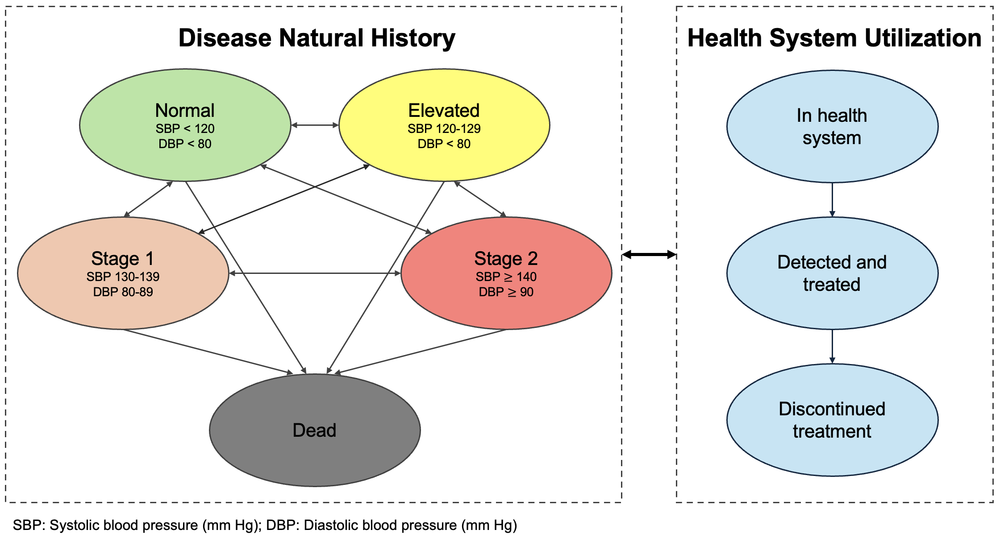{#fig-model-diagram}

### Data sources

Multiple data sources were used to parameterize our microsimulation model (@tbl-base-case). To obtain a simulation cohort representative of U.S. adults, we relied on survey data from the 2013-2014, 2015-2016, and 2017-2018 years of the National Health and Nutrition Examination Survey (NHANES).[@CDC2018] We sampled one million blood pressure measurements between January 2018 and June 2024 from the American Board of Family Medicine PRIME primary care electronic health record registry to estimate model transitions in hypertension natural history and health system utilization.[@phillips2024every] Baseline mortality rates were derived from 2021 age-, sex-, race-, and ethnicity-specific life tables.[@arias2023united] Remaining model parameters, including the effectiveness of antihypertensive treatments in lowering blood pressure, antihypertensive monotherapy utilization, and treatment discontinuation rates, were obtained from published literature as cited.

| Parameter  | Dependencies | Data |
|------------------------|------------------------|------------------------|
| Simulation cohort | Age, sex, race/ethnicity, systolic and diastolic blood pressure values | NHANES [@CDC2018] |
| *Disease natural history parameters* |  |  |
| Systolic blood pressure values | Age, sex | PRIME [@phillips2017prime] |
| Diastolic blood pressure values | Age, sex | PRIME [@phillips2017prime] |
| Hypertension mortality risk (hazard ratio) | Systolic and diastolic blood pressure values | Hansen et al. [@hansen2005ambulatory] |
| Baseline mortality rates | Age, sex, race/ethnicity | 2021 U.S. life tables [@arias2023united] |
| *Health system utilization parameters* |  |  |
| Transition to detected/treated | Age, sex, systolic and diastolic blood pressure values | PRIME [@phillips2017prime] |
| Transition to discontinued treatment | Type of antihypertensive therapy | ALLHAT @antihypertensive2002major  |
| *Antihypertensive treatment parameters* |  |  |
| Antihypertensive monotherapy utilization | Race/ethnicity (when using treatment guidelines that vary by race/ethnicity) | Holt et al. [@holt2022differences] |
| Antihypertensive treatment blood pressure reductions | Race/ethnicity (if heterogeneous effects are assumed), type of antihypertensive treatment | ALLHAT [@antihypertensive2002major] |

: Model parameter dependencies and data sources {#tbl-base-case}

### Simulation cohort {#sec-simulation-cohort}

Our simulation cohort consisted of 100,000 synthetic 40-year-old non-Hispanic Black and non-Hispanic white adults. We sampled synthetic individuals using a multivariate copula model fit to NHANES data ([Section S @sec-multi-copula]). Synthetic individuals differed by race/ethnicity, sex, initial systolic and diastolic blood pressure values, and blood pressure measurement frequencies.

### Disease natural history

The microsimulation model simulated lifetime systolic and diastolic blood pressure trajectories. Blood pressure values were categorized into hypertension stages using standard blood pressure cut-offs: normal (systolic \<120 mm Hg and diastolic \<80 mm Hg), elevated (systolic 120-129 mm Hg and diastolic \<80 mm Hg), stage 1 (systolic 130-139 mm Hg or diastolic 80-89 mm Hg), and stage 2 (systolic $\geq$ 140 mm Hg or diastolic $\geq$ 90 mm Hg).[@National2024what] To allow for individual variation in blood pressure, we fit quantile regressions to predict monthly systolic and diastolic blood pressure values using the PRIME registry ([Section S @sec-sys-dia-regressions]). Assigned quantiles for blood pressure prediction were updated every five years according to an exponential distribution, while preserving correlations between systolic and diastolic blood pressure values observed in the PRIME registry ([Section S @sec-sys-dia-correlations]). Treatment initiation lowered blood pressure according to treatment effects observed in the ALLHAT clinical trial, further described in @sec-interventions. Individuals who discontinued treatment returned to blood pressure trajectories before treatment exposure. Mortality rates varied by age, sex, race/ethnicity, and blood pressure. We used age-sex-race/ethnicity-specific mortality rates from the 2021 U.S. life tables.[@arias2023united] Individuals with elevated blood pressure experienced increased mortality risk ([Section S @sec-mortality-adjustments]).[@hansen2005ambulatory] 

### Health system utilization

All synthetic individuals were initialized as "in the health system" state (@fig-model-diagram). Treatment initiation was simulated in two steps. First, individual blood pressure measurement intervals ranged from monthly to annually according to their age, sex, and prior blood pressure values. Second, at each blood pressure measurement, the probability of initiating antihypertensive therapy was predicted as a function of age, sex, and systolic and diastolic blood pressure values ([Section S @sec-treatment-prob]). Given limitations of electronic health record data in measuring treatment discontinuation, treatment class-specific discontinuation rates were obtained from the ALLHAT trial.[@antihypertensive2002major] Our model assumed that individuals who discontinued treatment did not reinitiate treatment.

### Interventions {#sec-interventions}

We compared the 2025 AHA/ACC guideline, which removed race-specific antihypertensive treatment recommendations, with continued use of the 2017 AHA/ACC race-adjusted recommendations. Our analysis focused on first-line monotherapy with thiazide diuretics or angiotensin-converting enzyme (ACE) inhibitors among individuals with stage 1 or 2 hypertension. The 2017 AHA/ACC guidelines recommended thiazide diuretics or ACE inhibitors as first-line antihypertensive therapy. However, these guidelines also included a special recommendation for Black adults, removing ACE inhibitors as a first-line therapy for this racial group.[@whelton20182017] In simulating race-adjusted guidelines, non-Hispanic Black adults were prescribed thiazide diuretics only, whereas non-Hispanic white adults were prescribed both thiazide diuretics and ACE inhibitors.[@holt2022differences] The 2025 AHA/ACC guideline no longer includes a special recommendation by race. Our simulation assumed that prescribing patterns for thiazide diuretics and ACE inhibitors did not differ by race. 

Guideline changes were evaluated under two treatment effect scenarios: 1) heterogeneity in treatment effectiveness by race and 2) no heterogeneity in treatment effectiveness by race. In the first scenario, we used ALLHAT subgroup analyses that demonstrated treatment heterogeneity by race: ACE inhibitors were inferior to thiazide diuretics in blood pressure control and cardiovascular disease prevention among Black adults.[@wright2005outcomes] Blood pressure reductions and discontinuation rates differed by race in the simulation. In the second scenario, treatment effects and discontinuation rates were based on estimates from the overall ALLHAT trial population and were applied equally across racial/ethnic groups.[@antihypertensive2002major] Blood pressure reductions varied by years on treatment through year four of ALLHAT follow-up (@tbl-anti-hypertensive-treatment-effectiveness). Simulated individuals who remained on treatment after year four retained the year-four effect. 

| Antihypertensive Treatment | Year | Heterogeneous Treatment Effects |   | No Heterogeneous Treatment Effects |   |
|------------|------------|------------|------------|------------|------------|
|  |  | Black | Non-Black | Black | Non-Black |
| Thiazide diuretic | 1 | 7.7/3.9 | 9.8/4.7 | 9.3/4.7 | 9.3/4.7 |
|  | 2 | 8.6/5.0 | 10.6/5.8 | 10.3/5.7 | 10.3/5.7 |
|  | 4 | 10.5/6.6 | 12.3/7.6 | 12.3/7.5 | 12.3/7.5 |
| ACE inhibitor | 1 | 2.5/2.3 | 8.1/4.9 | 6.1/4.2 | 6.1/4.2 |
|  | 2 | 3.4/3.4 | 9.5/6.1 | 8.0/5.5 | 8.0/5.5 |
|  | 4 | 6.8/5.6 | 12.0/8.0 | 10.9/7.5 | 10.9/7.5 |

: Reduction in blood pressure (systolic/diastolic, mm Hg) by antihypertensive treatment type and treatment effect heterogeneity assumption {#tbl-anti-hypertensive-treatment-effectiveness}

ACE inhibitor: angiotensin-converting enzyme inhibitor

### Outcomes and analysis

To validate the hypertension disease natural history process, we simulated a hypothetical cohort of 10,000 individuals from the PRIME registry before antihypertensive treatment exposure ([Section S @sec-validation-results]). Our main outcomes included life expectancy, years spent with stage 1 or 2 hypertension, cumulative incidence and duration of antihypertensive treatment, and years with uncontrolled hypertension. We defined uncontrolled hypertension as having stage 1 or stage 2 blood pressure values while receiving treatment. We reported mean estimates and 95% confidence intervals with Monte Carlo standard errors (MCSEs) for all outcomes.

### Secondary analysis

In a secondary analysis, we leveraged the previously published social factors framework, a decision-modeling approach for health policy analyses when outcomes are influenced by both disease and social processes.[@cusick2026novel] Two social factors were additionally modeled in our microsimulation model: health insurance status and census tract-level social deprivation index (SDI) ([Section S @sec-secondary-analysis], @suppfig-model-diagram, @supptbl-base-case). Census tract-level SDI served as a proxy for socioeconomic status and captured geographic variation in hypertension prevalence, awareness, and control.[@cdc2023million; @muntner2020trends] The updated model included a fourth health system stage, out of the health system, representing individuals without a routine place for healthcare. At model initiation, synthetic individuals were assigned a census tract-level SDI, insurance status, and an initial health system state ([Section S @sec-multi-copula], [Section S @sec-sdi-assignment]).[@butler2013measures]. After age 65, all simulated individuals were assumed to have insurance through Medicare coverage. 

To incorporate the impact of the social factors on disease natural history, we modified several model parameters and transition probability dependencies. Baseline mortality rates were further adjusted by insurance status.[@wilper2009health;@kronick2009health;@tolbert2024uninsured] Having no health insurance increased baseline mortality rates, assuming a hazard ratio for increased mortality risk among those uninsured ([Section S @sec-mortality-insurance]). We predicted systolic and diastolic blood pressure trajectories as a function of age, sex, and census tract-level SDI ([Section S @sec-sys-dia-regressions], [Section S @sec-sys-dia-correlations]).

Insurance status and census tract-level SDI also influenced health system utilization. Uninsured individuals were less likely to enter the health system and had elevated blood pressures compared to insured individuals, as observed in NHANES ([Section S @sec-transition-in-system], [Section S @sec-out-of-system-BP]). Treatment initiation rates varied by census tract-level SDI. We predicted blood pressure measurement frequencies and antihypertensive treatment probabilities as a function of age, sex, systolic and diastolic blood pressure values, and census tract-level SDI ([Section S @sec-treatment-prob]). Finally, uninsured individuals were assumed to discontinue treatment at faster rates compared to insured individuals.[@fernandez2019medication]

## Results

```{python}
#|include: false
with open(f"results/{folder}/cohort_statistics/standard/demo.pkl", "rb") as f:
    demo_dict = pickle.load(f)

with open(f"results/{folder}/cohort_statistics/standard/demo_NHB.pkl", "rb") as f:
    demo_dict_NHB = pickle.load(f)

with open(f"results/{folder}/cohort_statistics/standard/demo_NHW.pkl", "rb") as f:
    demo_dict_NHW = pickle.load(f)

```

### Cohort characteristics

The simulation cohort included 100,000 adults aged 40 years, evenly divided between non-Hispanic Black and non-Hispanic white individuals. At age 40, non-Hispanic Black adults had a higher proportion of individuals in hypertension stages 1 (`{python} convert_to_percent(demo_dict_NHB['Stage 1'][0])`% vs. `{python} convert_to_percent(demo_dict_NHW['Stage 1'][0])`%) and stage 2 (`{python} convert_to_percent(demo_dict_NHB['Stage 2'][0])`% vs. `{python} convert_to_percent(demo_dict_NHW['Stage 2'][0])`%) compared to non-Hispanic white adults (@tbl-demographics-by-race). In model validation, simulation model outputs were concordant with age-specific hypertension prevalence estimates in the PRIME registry (@supptbl-validation-life-expectancy, @suppfig-validation-results).

| Characteristic  |   | Non-Hispanic Black (N=50,000) | Non-Hispanic white (N=50,000) |
|------------------|------------------|------------------|------------------|
| Female (%) |  | `{python} convert_to_percent(demo_dict_NHB['female'][0])`% | `{python} convert_to_percent(demo_dict_NHW['female'][0])`% |
| Hypertension stage (%) | Normal | `{python} convert_to_percent(demo_dict_NHB['Normal'][0])`% | `{python} convert_to_percent(demo_dict_NHW['Normal'][0])`% |
|  | Elevated | `{python} convert_to_percent(demo_dict_NHB['Elevated'][0])`% | `{python} convert_to_percent(demo_dict_NHW['Elevated'][0])`% |
|  | Stage 1 | `{python} convert_to_percent(demo_dict_NHB['Stage 1'][0])`% | `{python} convert_to_percent(demo_dict_NHW['Stage 1'][0])`% |
|  | Stage 2 | `{python} convert_to_percent(demo_dict_NHB['Stage 2'][0])`% | `{python} convert_to_percent(demo_dict_NHW['Stage 2'][0])`% |
| Systolic blood pressure (mean \[SD\]) |  | `{python} format_value_and_se(demo_dict_NHB['systolic_bp'], digits = 1)` | `{python} format_value_and_se(demo_dict_NHW['systolic_bp'], digits = 1)` |
| Diastolic blood pressure (mean \[SD\]) |  | `{python} format_value_and_se(demo_dict_NHB['diastolic_bp'], digits = 1)` | `{python} format_value_and_se(demo_dict_NHW['diastolic_bp'], digits = 1)` |

: Demographic and clinical characteristics of simulation cohort by race
{#tbl-demographics-by-race}

SD: Standard deviation

```{python}
#|include: false

##START READING IN STANDARD RESULTS

#### HETERO RA
with open(f"results/{folder}/cohort_outcomes/standard/overall_hetero_RA.pkl", "rb") as f:
    standard_hetero_ra_dict = pickle.load(f)
###HETERO NR 
with open(f"results/{folder}/cohort_outcomes/standard/overall_hetero_NR.pkl", "rb") as f:
    standard_hetero_nr_dict = pickle.load(f)
### HETERO RACE RA
with open(f"results/{folder}/cohort_outcomes/standard/race_group_hetero_RA.pkl", "rb") as f:
    standard_race_hetero_ra_dict = pickle.load(f)
## HETERO RACE NR
with open(f"results/{folder}/cohort_outcomes/standard/race_group_hetero_NR.pkl", "rb") as f:
    standard_race_hetero_nr_dict = pickle.load(f)
### NO HETERO RA 
with open(f"results/{folder}/cohort_outcomes/standard/overall_nohetero_RA.pkl", "rb") as f:
    standard_nohetero_ra_dict = pickle.load(f)
### NO HETERO NR
with open(f"results/{folder}/cohort_outcomes/standard/overall_nohetero_NR.pkl", "rb") as f:
    standard_nohetero_nr_dict = pickle.load(f)

## NO HETERO RACE RA
with open(f"results/{folder}/cohort_outcomes/standard/race_group_nohetero_RA.pkl", "rb") as f:
    standard_race_nohetero_ra_dict = pickle.load(f)
## NO HETERO RACE NR 
with open(f"results/{folder}/cohort_outcomes/standard/race_group_nohetero_NR.pkl", "rb") as f:
    standard_race_nohetero_nr_dict = pickle.load(f)

##HYPERTENSION CONTROL
#hetero NR
standard_hetero_NR_hyp_control = pd.read_csv(f"results/{folder}/cohort_outcomes/standard/control_hyp_prev_hetero_NR.csv")
#hetero RA
standard_hetero_RA_hyp_control = pd.read_csv(f"results/{folder}/cohort_outcomes/standard/control_hyp_prev_hetero_RA.csv")
#no hetero RA
standard_nohetero_RA_hyp_control = pd.read_csv(f"results/{folder}/cohort_outcomes/standard/control_hyp_prev_nohetero_RA.csv")
# no hetero NR
standard_nohetero_NR_hyp_control = pd.read_csv(f"results/{folder}/cohort_outcomes/standard/control_hyp_prev_nohetero_NR.csv")

```

### Heterogeneity in treatment effectiveness by race 

Implementing antihypertensive guidelines without race adjustment shifted prescribing patterns for non-Hispanic Black adults, increasing the cumulative incidence of ACE inhibitor use from `{python} convert_to_percent(standard_race_hetero_ra_dict['NHB']['cum_inc_treated'][0] - standard_race_hetero_ra_dict['NHB']['cum_inc_treated_TD'][0])`% to `{python} convert_to_percent(standard_race_hetero_nr_dict['NHB']['cum_inc_treated'][0] - standard_race_hetero_nr_dict['NHB']['cum_inc_treated_TD'][0])`% and reducing thiazide diuretic use from `{python} convert_to_percent(standard_race_hetero_ra_dict['NHB']['cum_inc_treated_TD'][0])`% to `{python} convert_to_percent(standard_race_hetero_nr_dict['NHB']['cum_inc_treated_TD'][0])`% (@supptbl-standard-treatment-utilization). Prescribing patterns for non-Hispanic white adults were unchanged, with the cumulative incidence of ACE inhibitor and thiazide diuretic use at 
`{python} convert_to_percent(standard_race_hetero_ra_dict['NHW']['cum_inc_treated'][0] - standard_race_hetero_ra_dict['NHW']['cum_inc_treated_TD'][0])`% and `{python} convert_to_percent(standard_race_hetero_ra_dict['NHW']['cum_inc_treated_TD'][0])`%, respectively. Because ACE inhibitors produced smaller blood pressure reductions and higher discontinuation rates among non-Hispanic Black adults, this prescribing shift had adverse consequences for health outcomes, healthcare utilization, and racial/ethnic disparities. 


#### Health outcomes

The cumulative incidence of stage 1 or 2 hypertension was unchanged at `{python} convert_to_percent(standard_hetero_ra_dict['cum_inc_sick'][0])`% under both guideline versions  (@supptbl-standard-main-results). Implementing guidelines that no longer account for race increased time spent with hypertension for non-Hispanic Black adults. Years with stage 1 or 2 hypertension increased from `{python} create_95_CI(standard_race_hetero_ra_dict['NHB']['years_sick'], "years")` under race-adjusted guidelines to `{python} create_95_CI(standard_race_hetero_nr_dict['NHB']['years_sick'], "years")` (@fig-main-sick). Life expectancy among non-Hispanic Black adults also decreased from `{python} create_95_CI(standard_race_hetero_ra_dict['NHB']['years_to_death'], "years")` to `{python} create_95_CI(standard_race_hetero_nr_dict['NHB']['years_to_death'], "years")`. This decline widened the life expectancy gap with non-Hispanic white adults from `{python} round(standard_race_hetero_ra_dict['Difference']['years_to_death'][0], ROUND_DIGITS)` years to `{python} round(standard_race_hetero_nr_dict['Difference']['years_to_death'][0], ROUND_DIGITS)` years (@tbl-standard-main-results-by-race, @fig-main-le).

| Outcome | Group | Heterogeneous Treatment Effects |   | No Heterogeneous Treatment Effects |   |
|------------|------------|------------|------------|------------|------------|
|  |  | Race Adjustment | No Race Adjustment | Race Adjustment | No Race Adjustment |
| Years spent in stage 1 or 2 hypertension | Non-Hispanic Black | `{python} format_value_and_se(standard_race_hetero_ra_dict['NHB']['years_sick'])` | `{python} format_value_and_se(standard_race_hetero_nr_dict['NHB']['years_sick'])` | `{python} format_value_and_se(standard_race_nohetero_ra_dict['NHB']['years_sick'])` | `{python} format_value_and_se(standard_race_nohetero_nr_dict['NHB']['years_sick'])` |
|  | Non-Hispanic white | `{python} format_value_and_se(standard_race_hetero_ra_dict['NHW']['years_sick'])` | `{python} format_value_and_se(standard_race_hetero_nr_dict['NHW']['years_sick'])` | `{python} format_value_and_se(standard_race_nohetero_ra_dict['NHW']['years_sick'])` | `{python} format_value_and_se(standard_race_nohetero_nr_dict['NHW']['years_sick'])` |
|  | Difference | `{python} format_value_and_se(standard_race_hetero_ra_dict['Difference']['years_sick'])` | `{python} format_value_and_se(standard_race_hetero_nr_dict['Difference']['years_sick'])` | `{python} format_value_and_se(standard_race_nohetero_ra_dict['Difference']['years_sick'])` | `{python} format_value_and_se(standard_race_nohetero_nr_dict['Difference']['years_sick'])` |
| Years on antihypertensive treatment | Non-Hispanic Black | `{python} format_value_and_se(standard_race_hetero_ra_dict['NHB']['years_treated'])` | `{python} format_value_and_se(standard_race_hetero_nr_dict['NHB']['years_treated'])` | `{python} format_value_and_se(standard_race_nohetero_ra_dict['NHB']['years_treated'])` | `{python} format_value_and_se(standard_race_nohetero_nr_dict['NHB']['years_treated'])` |
|  | Non-Hispanic white | `{python} format_value_and_se(standard_race_hetero_ra_dict['NHW']['years_treated'])` | `{python} format_value_and_se(standard_race_hetero_nr_dict['NHW']['years_treated'])` | `{python} format_value_and_se(standard_race_nohetero_ra_dict['NHW']['years_treated'])` | `{python} format_value_and_se(standard_race_nohetero_nr_dict['NHW']['years_treated'])` |
|  | Difference | `{python} format_value_and_se(standard_race_hetero_ra_dict['Difference']['years_treated'])` | `{python} format_value_and_se(standard_race_hetero_nr_dict['Difference']['years_treated'])` | `{python} format_value_and_se(standard_race_nohetero_ra_dict['Difference']['years_treated'])` | `{python} format_value_and_se(standard_race_nohetero_nr_dict['Difference']['years_treated'])` |
| Years with uncontrolled hypertension | Non-Hispanic Black | `{python} format_value_and_se(standard_race_hetero_ra_dict['NHB']['years_sick_treated'])` | `{python} format_value_and_se(standard_race_hetero_nr_dict['NHB']['years_sick_treated'])` | `{python} format_value_and_se(standard_race_nohetero_ra_dict['NHB']['years_sick_treated'])` | `{python} format_value_and_se(standard_race_nohetero_nr_dict['NHB']['years_sick_treated'])` |
|  | Non-Hispanic white | `{python} format_value_and_se(standard_race_hetero_ra_dict['NHW']['years_sick_treated'])` | `{python} format_value_and_se(standard_race_hetero_nr_dict['NHW']['years_sick_treated'])` | `{python} format_value_and_se(standard_race_nohetero_ra_dict['NHW']['years_sick_treated'])` | `{python} format_value_and_se(standard_race_nohetero_nr_dict['NHW']['years_sick_treated'])` |
|  | Difference | `{python} format_value_and_se(standard_race_hetero_ra_dict['Difference']['years_sick_treated'])` | `{python} format_value_and_se(standard_race_hetero_nr_dict['Difference']['years_sick_treated'])` | `{python} format_value_and_se(standard_race_nohetero_ra_dict['Difference']['years_sick_treated'])` | `{python} format_value_and_se(standard_race_nohetero_nr_dict['Difference']['years_sick_treated'])` |
| Life expectancy | Non-Hispanic Black | `{python} format_value_and_se(standard_race_hetero_ra_dict['NHB']['years_to_death'])` | `{python} format_value_and_se(standard_race_hetero_nr_dict['NHB']['years_to_death'])` | `{python} format_value_and_se(standard_race_nohetero_ra_dict['NHB']['years_to_death'])` | `{python} format_value_and_se(standard_race_nohetero_nr_dict['NHB']['years_to_death'])` |
|  | Non-Hispanic white | `{python} format_value_and_se(standard_race_hetero_ra_dict['NHW']['years_to_death'])` | `{python} format_value_and_se(standard_race_hetero_nr_dict['NHW']['years_to_death'])` | `{python} format_value_and_se(standard_race_nohetero_ra_dict['NHW']['years_to_death'])` | `{python} format_value_and_se(standard_race_nohetero_nr_dict['NHW']['years_to_death'])` |
|  | Difference | `{python} format_value_and_se(standard_race_hetero_ra_dict['Difference']['years_to_death'])` | `{python} format_value_and_se(standard_race_hetero_nr_dict['Difference']['years_to_death'])` | `{python} format_value_and_se(standard_race_nohetero_ra_dict['Difference']['years_to_death'])` | `{python} format_value_and_se(standard_race_nohetero_nr_dict['Difference']['years_to_death'])` | 

: Main outcomes for non-Hispanic Black and non-Hispanic white adults comparing antihypertensive treatment guidelines with and without race adjustment
{#tbl-standard-main-results-by-race}

Mean [Monte Carlo standard error] 

#### Health system utilization

Treatment initiation was similar across groups, with the cumulative incidence of antihypertensive treatment of `{python} convert_to_percent(standard_hetero_ra_dict['cum_inc_treated'][0])`% in the overall cohort and across both racial groups (@supptbl-standard-main-results). The shift towards ACE inhibitors reduced the average duration of antihypertensive treatment among non-Hispanic Black adults from `{python} create_95_CI(standard_race_hetero_ra_dict['NHB']['years_treated'], "years")` to `{python} create_95_CI(standard_race_hetero_nr_dict['NHB']['years_treated'], "years")`. As a result, the treatment duration gap with non-Hispanic white adults widened from `{python} round(standard_race_hetero_ra_dict['Difference']['years_treated'][0], ROUND_DIGITS)` years to `{python} round(standard_race_hetero_nr_dict['Difference']['years_treated'][0], ROUND_DIGITS)` years (@fig-main-treated). Hypertension control also worsened. Among non-Hispanic Black adults, years with uncontrolled hypertension increased from `{python} create_95_CI(standard_race_hetero_ra_dict['NHB']['years_sick_treated'], "years")` to `{python} create_95_CI(standard_race_hetero_nr_dict['NHB']['years_sick_treated'], "years")` (@fig-main-sick-treated). The fraction of treatment time with uncontrolled hypertension rose from 
`{python} convert_to_percent(standard_race_hetero_ra_dict['NHB']['uncontrolled_percent'][0])`% to `{python} convert_to_percent(standard_race_hetero_nr_dict['NHB']['uncontrolled_percent'][0])`%, compared with `{python} convert_to_percent(standard_race_hetero_ra_dict['NHW']['uncontrolled_percent'][0])`% among non-Hispanic white adults. 

::: {#fig-standard-main-results-race layout-nrow="2"}
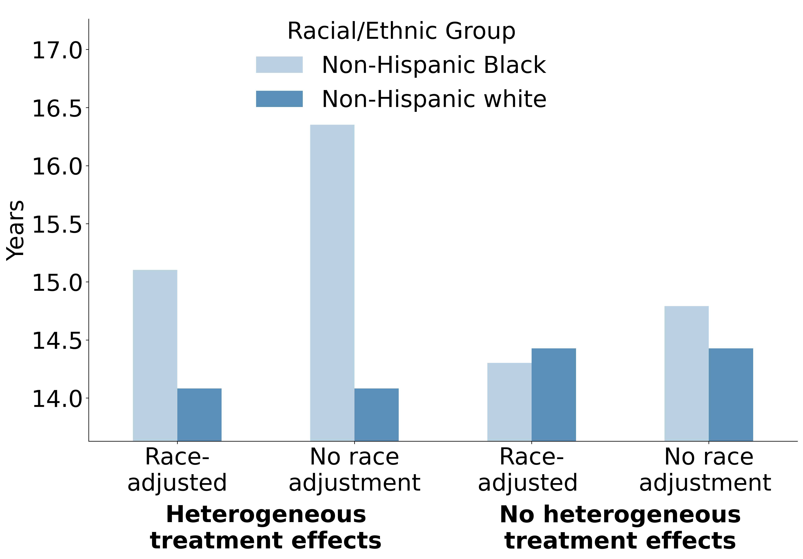{#fig-main-sick}

{#fig-main-le}

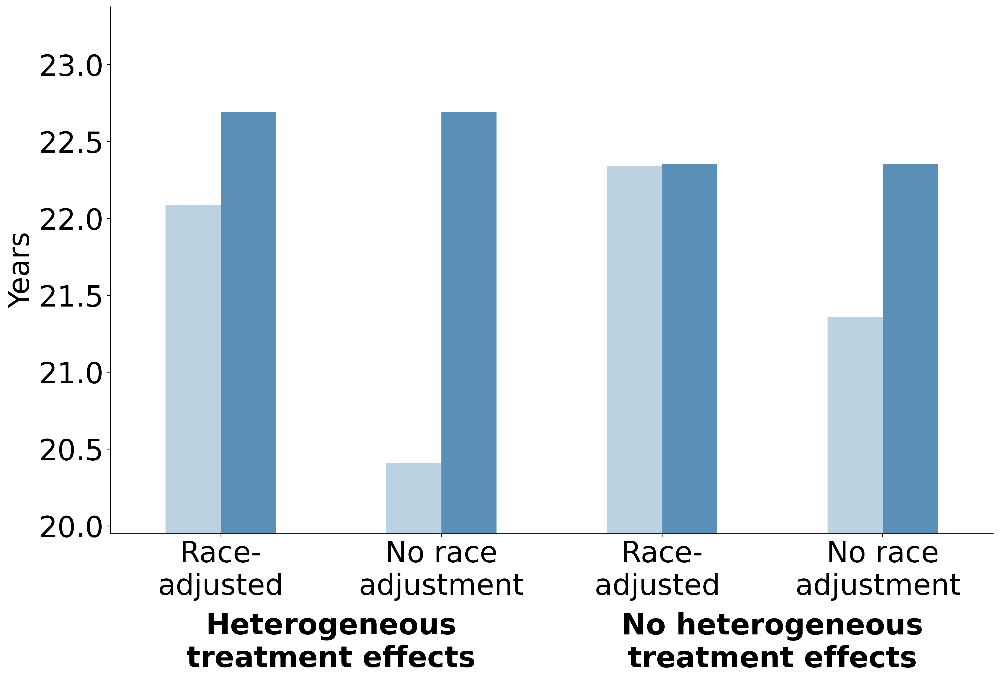{#fig-main-treated}

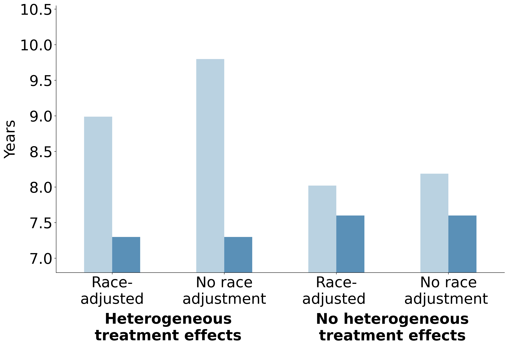{#fig-main-sick-treated}

Comparing antihypertensive treatment guidelines with and without race adjustment for non-Hispanic Black and non-Hispanic white adults. Outcomes: (a) years with stage 1 or 2 hypertension, (b) life expectancy, (c) years on antihypertensive treatment, (d) years with uncontrolled hypertension
:::

### No heterogeneity in treatment effectiveness by race 

Under assumptions of no racial heterogeneity, the prescribing shift towards ACE inhibitors still worsened outcomes for non-Hispanic Black adults because ACE inhibitors were less effective at reducing blood pressure than thiazide diuretics overall. However, the magnitude of effects was smaller than in the heterogeneous effects scenario (@fig-standard-main-results-race). 

#### Health outcomes

Guidelines without race adjustment increased years spent in stage 1 or 2 hypertension for non-Hispanic Black adults from `{python} create_95_CI(standard_race_nohetero_ra_dict['NHB']['years_sick'], "years")` to `{python} create_95_CI(standard_race_nohetero_nr_dict['NHB']['years_sick'], "years")`, a `{python} round(standard_race_nohetero_nr_dict['NHB']['years_sick'][0]- standard_race_nohetero_ra_dict['NHB']['years_sick'][0], ROUND_DIGITS)`-year increase compared to `{python} round(standard_race_hetero_nr_dict['NHB']['years_sick'][0]- standard_race_hetero_ra_dict['NHB']['years_sick'][0], ROUND_DIGITS)` years in the first scenario (@tbl-standard-main-results-by-race, @fig-standard-main-results-race). The effect on life expectancy among non-Hispanic Black adults was also smaller, decreasing from `{python} create_95_CI(standard_race_nohetero_ra_dict['NHB']['years_to_death'], "years")` to `{python} create_95_CI(standard_race_nohetero_nr_dict['NHB']['years_to_death'], "years")`. This `{python} -(round(standard_race_nohetero_ra_dict['Difference']['years_to_death'][0] - standard_race_nohetero_nr_dict['Difference']['years_to_death'][0], ROUND_DIGITS))`-year widening was less than half that observed in the first scenario (@tbl-standard-main-results-by-race, @fig-standard-main-results-race). 

#### Healthcare utilization

Healthcare utilization patterns were similar to the first scenario, though changes were smaller in magnitude. Average treatment duration among non-Hispanic Black adults decreased by `{python} -(round(standard_race_nohetero_nr_dict['NHB']['years_treated'][0] - standard_race_nohetero_ra_dict['NHB']['years_treated'][0], ROUND_DIGITS))` years, from `{python} create_95_CI(standard_race_nohetero_ra_dict['NHB']['years_treated'], "years")` to `{python} create_95_CI(standard_race_nohetero_nr_dict['NHB']['years_treated'], "years")`, a smaller decline than the `{python} -(round(standard_race_hetero_nr_dict['NHB']['years_treated'][0] - standard_race_hetero_ra_dict['NHB']['years_treated'][0], ROUND_DIGITS))`-year decrease in the first scenario (@tbl-standard-main-results-by-race). Years with uncontrolled hypertension went from `{python} create_95_CI(standard_race_nohetero_ra_dict['NHB']['years_sick_treated'], "years")` to `{python} create_95_CI(standard_race_nohetero_nr_dict['NHB']['years_sick_treated'], "years")`. As a result, the fraction of treatment time with uncontrolled hypertension rose by `{python} convert_to_percent(standard_race_nohetero_nr_dict['NHB']['uncontrolled_percent'][0]) - convert_to_percent(standard_race_nohetero_ra_dict['NHB']['uncontrolled_percent'][0])` percentage points, compared to `{python} convert_to_percent(standard_race_hetero_nr_dict['NHB']['uncontrolled_percent'][0]) - convert_to_percent(standard_race_hetero_ra_dict['NHB']['uncontrolled_percent'][0])` percentage points in the first scenario.


### Secondary analysis

```{python}
#|include: false
with open(f"results/{folder}/cohort_outcomes/social/overall_hetero_RA.pkl", "rb") as f:
    hetero_ra_dict = pickle.load(f)
with open(f"results/{folder}/cohort_outcomes/social/overall_hetero_NR.pkl", "rb") as f:
    hetero_nr_dict = pickle.load(f)

with open(f"results/{folder}/cohort_outcomes/social/race_group_hetero_RA.pkl", "rb") as f:
    race_hetero_ra_dict = pickle.load(f)
with open(f"results/{folder}/cohort_outcomes/social/race_group_hetero_NR.pkl", "rb") as f:
    race_hetero_nr_dict = pickle.load(f)

with open(f"results/{folder}/cohort_outcomes/social/race_insurance_group_hetero_RA.pkl", "rb") as f:
    race_ins_hetero_ra_dict = pickle.load(f)
with open(f"results/{folder}/cohort_outcomes/social/race_insurance_group_hetero_NR.pkl", "rb") as f:
    race_ins_hetero_nr_dict = pickle.load(f)

hetero_NR_hyp_control = pd.read_csv(f"results/{folder}/cohort_outcomes/social/control_hyp_prev_hetero_NR.csv")

hetero_RA_hyp_control = pd.read_csv(f"results/{folder}/cohort_outcomes/social/control_hyp_prev_hetero_RA.csv")

with open(f"results/{folder}/cohort_outcomes/social/overall_nohetero_RA.pkl", "rb") as f:
    nohetero_ra_dict = pickle.load(f)
with open(f"results/{folder}/cohort_outcomes/social/overall_nohetero_NR.pkl", "rb") as f:
    nohetero_nr_dict = pickle.load(f)

with open(f"results/{folder}/cohort_outcomes/social/race_group_nohetero_RA.pkl", "rb") as f:
    race_nohetero_ra_dict = pickle.load(f)
with open(f"results/{folder}/cohort_outcomes/social/race_group_nohetero_NR.pkl", "rb") as f:
    race_nohetero_nr_dict = pickle.load(f)
with open(f"results/{folder}/cohort_outcomes/social/race_insurance_group_nohetero_RA.pkl", "rb") as f:
    race_ins_nohetero_ra_dict = pickle.load(f)
with open(f"results/{folder}/cohort_outcomes/social/race_insurance_group_nohetero_NR.pkl", "rb") as f:
    race_ins_nohetero_nr_dict = pickle.load(f)

nohetero_RA_hyp_control = pd.read_csv(f"results/{folder}/cohort_outcomes/social/control_hyp_prev_nohetero_RA.csv")

nohetero_NR_hyp_control = pd.read_csv(f"results/{folder}/cohort_outcomes/social/control_hyp_prev_nohetero_NR.csv")


```

Insurance coverage was higher among non-Hispanic white 40-year-old adults (`{python} convert_to_percent(demo_dict_NHW['insurance'][0])`%) than among non-Hispanic Black 40-year-old adults (`{python} convert_to_percent(demo_dict_NHB['insurance'][0])`%). Mean census tract-level SDI was also higher for non-Hispanic Black adults (`{python} round(demo_dict_NHB['SDI'][0], ROUND_DIGITS)`) compared to non-Hispanic white adults (`{python} round(demo_dict_NHW['SDI'][0], ROUND_DIGITS)`), reflecting greater neighborhood disadvantage (@supptbl-sff-cohort). Incorporating census tract-level SDI and insurance coverage reduced overall treatment access. The overall incidence of treatment dropped from `{python} convert_to_percent(standard_hetero_ra_dict['cum_inc_treated'][0])`% in the main analysis to `{python} convert_to_percent(hetero_ra_dict['cum_inc_treated'][0])`%. While treatment incidence did not differ by race, it differed by insurance status (@supptbl-sff-main-results). Among those without insurance, `{python} convert_to_percent(race_ins_hetero_ra_dict[(0,'NHB')]['cum_inc_treated'][0])`% and  `{python} convert_to_percent(race_ins_hetero_ra_dict[(0,'NHW')]['cum_inc_treated'][0])`% of non-Hispanic Black and non-Hispanic white adults initiated treatment, compared to `{python} convert_to_percent(race_ins_hetero_ra_dict[(1,'NHB')]['cum_inc_treated'][0])`% and `{python} convert_to_percent(race_ins_hetero_ra_dict[(1,'NHW')]['cum_inc_treated'][0])`% of insured non-Hispanic Black and non-Hispanic white adults (@fig-cum-incidence-treatment). 

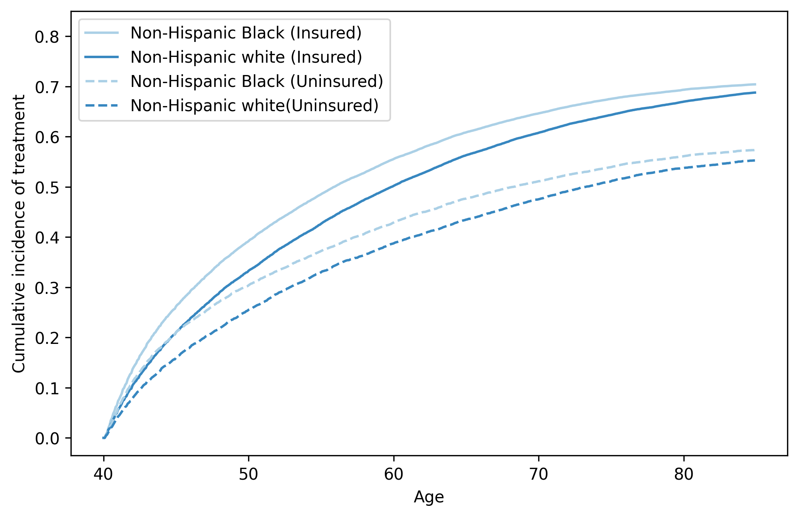{#fig-cum-incidence-treatment}

#### Heterogeneity in treatment effectiveness by race
Under guidelines without race adjustment, life expectancy among non-Hispanic Black adults decreased by `{python} round(race_hetero_nr_dict['Difference']['years_to_death'][0] - race_hetero_ra_dict['Difference']['years_to_death'][0], ROUND_DIGITS)` years, from `{python} create_95_CI(race_hetero_ra_dict['NHB']['years_to_death'], "years")` to `{python} create_95_CI(race_hetero_nr_dict['NHB']['years_to_death'], "years")`, although with overlapping confidence intervals. This effect was the same as the `{python} round(standard_race_hetero_nr_dict['Difference']['years_to_death'][0] - standard_race_hetero_ra_dict['Difference']['years_to_death'][0], ROUND_DIGITS)`-year effect observed in the main analysis (@supptbl-sff-results-by-race, @suppfig-sff-results-race). Because insured non-Hispanic Black adults had greater treatment access, they were more likely to be affected by the prescribing shift towards ACE inhibitors. The average decline in life expectancy was `{python} round(race_ins_hetero_ra_dict[(1,'NHB')]['years_to_death'][0] - race_ins_hetero_nr_dict[(1,'NHB')]['years_to_death'][0], ROUND_DIGITS)` years for non-Hispanic Black adults with insurance compared to `{python} round(race_ins_hetero_ra_dict[(0,'NHB')]['years_to_death'][0] - race_ins_hetero_nr_dict[(0,'NHB')]['years_to_death'][0], ROUND_DIGITS)` years for those without insurance (@supptbl-main-results-by-race-insurance). We observed a similar pattern in hypertension control. Years spent with uncontrolled hypertension increased by `{python} round(race_ins_hetero_nr_dict[(1,'NHB')]['years_sick_treated'][0] - race_ins_hetero_ra_dict[(1,'NHB')]['years_sick_treated'][0], ROUND_DIGITS)` years and `{python} round(race_ins_hetero_nr_dict[(0,'NHB')]['years_sick_treated'][0] - race_ins_hetero_ra_dict[(0,'NHB')]['years_sick_treated'][0], ROUND_DIGITS)` years among non-Hispanic Black adults with and without insurance, respectively. 

#### No heterogeneity in treatment effectiveness by race

As in the main analysis, the effects of guidelines without race adjustment were smaller under the no treatment heterogeneity scenario. The decline in life expectancy for non-Hispanic Black adults was the same as the `{python} -(round(standard_race_nohetero_ra_dict['Difference']['years_to_death'][0] - standard_race_nohetero_nr_dict['Difference']['years_to_death'][0], ROUND_DIGITS))`-year widening in the main analysis (@supptbl-sff-results-by-race, @suppfig-sff-results-race). In this scenario, we observed no differences in life expectancy decreases among non-Hispanic Black adults with insurance (`{python} -round(race_ins_nohetero_nr_dict[(1,'NHB')]['years_to_death'][0] - race_ins_nohetero_ra_dict[(1,'NHB')]['years_to_death'][0], ROUND_DIGITS)` years) and without insurance (`{python} -round(race_ins_nohetero_nr_dict[(0,'NHB')]['years_to_death'][0] - race_ins_nohetero_ra_dict[(0,'NHB')]['years_to_death'][0], ROUND_DIGITS)` years) (@supptbl-main-results-by-race-insurance). Increases in years with uncontrolled hypertension were higher among non-Hispanic Black adults with insurance (`{python} round(race_ins_nohetero_nr_dict[(1,'NHB')]['years_sick_treated'][0] - race_ins_nohetero_ra_dict[(1,'NHB')]['years_sick_treated'][0], ROUND_DIGITS)` years) compared to those without (`{python} round(race_ins_nohetero_nr_dict[(0,'NHB')]['years_sick_treated'][0] - race_ins_nohetero_ra_dict[(0,'NHB')]['years_sick_treated'][0], ROUND_DIGITS)` years). However, differences by insurance status were smaller than in the scenario 
assuming racial heterogeneity in treatment effects.

## Discussion

Our findings indicate that implementing antihypertensive treatment guidelines that no longer account for race may have adverse consequences for health outcomes and healthcare utilization among non-Hispanic Black adults, widening disparities with non-Hispanic white adults. However, the magnitude of these effects depended on assumptions of treatment heterogeneity by race. 

Under assumptions of racial heterogeneity in treatment effectiveness, guidelines without race adjustment increased utilization of ACE inhibitors among non-Hispanic Black adults, a treatment class associated with smaller blood pressure reductions and higher discontinuation rates in this racial/ethnic group. This prescribing shift resulted in an average 
`{python} round(standard_race_hetero_nr_dict['NHB']['years_sick_treated'][0] - standard_race_hetero_ra_dict['NHB']['years_sick_treated'][0], ROUND_DIGITS)`-year increase in years with uncontrolled hypertension and an average
 `{python} round(standard_race_hetero_ra_dict['NHB']['years_to_death'][0] - standard_race_hetero_nr_dict['NHB']['years_to_death'][0], ROUND_DIGITS)`-year decrease in life expectancy among non-Hispanic Black adults, widening disparities with non-Hispanic white adults.

When treatment effectiveness was assumed equal across racial/ethnic groups, this same prescribing shift produced more modest effects, as ACE inhibitors were associated with smaller reductions in blood pressure compared to thiazide diuretics. Consequently, years with uncontrolled hypertension increased by `{python} round(standard_race_nohetero_nr_dict['NHB']['years_sick_treated'][0] - standard_race_nohetero_ra_dict['NHB']['years_sick_treated'][0], ROUND_DIGITS)` years, and life expectancy decreased by `{python} round(standard_race_nohetero_ra_dict['NHB']['years_to_death'][0] - standard_race_nohetero_nr_dict['NHB']['years_to_death'][0], ROUND_DIGITS)` years for non-Hispanic Black adults, less than one-fourth and one-half, respectively, of the effect observed under heterogeneous treatment assumptions. These results suggest that the consequences of guidelines without race adjustment for non-Hispanic Black adults are the most severe if racial heterogeneity in treatment effectiveness exists. 

The existence of antihypertensive treatment heterogeneity by race is unclear. Beyond evidence from ALLHAT, analyses from the Veterans Affairs system, All of Us Research program, and additional clinical trials have demonstrated racial and ethnic differences in hypertension control across antihypertensive medication classes.[@wright2002effect;@wright2005outcomes;@wright2008clinical;@preston1998age;@gupta2010ethnic;@gupta2010racial;@goleva2024racial] However, it has not been established whether these differences are attributable to race, given evidence that race may not be a reliable proxy for genetic variation.[@vyas2020hidden;@sehgal2004overlap] Instead, observed treatment heterogeneity may be driven by differences in health insurance coverage, health literacy, medication adherence, or lower trust in the healthcare system.[@aggarwal2021racial;@hertz2005racial;@abrahamowicz2023racial]

As a secondary analysis, we examined how incorporating heterogeneity in census tract-level SDI and health insurance coverage modified our findings. While non-Hispanic Black adults had lower rates of insurance coverage and higher census tract-level SDI values, we did not observe meaningful differences in life expectancy or hypertension control by racial groups compared to our main analysis. However, the adverse effects of guidelines that no longer account for race were more modest for non-Hispanic Black adults without insurance who had lower treatment access and thus less exposure to the prescribing shift towards ACE inhibitors. We argue that changes to clinical guidelines cannot be evaluated in isolation from the social context in which they are implemented. 

Previous studies have examined the implications of removing race from clinical decision-making on health equity, most often in the context of race-adjusted clinical algorithms. These studies demonstrate that simply eliminating race from clinical algorithms does not necessarily improve and may, in some cases, exacerbate racial and ethnic disparities across clinical domains, including in chronic kidney disease, lung cancer, and colorectal cancer detection.[@cusick2024algorithmic; @zink2024race;@khan2024development;@bonner2023clinical] Although several professional organizations have acknowledged the need to remove race from clinical practice guidelines,[@gilliam2022use; @american2020joint; @davidson2021actions] to our knowledge, no studies have evaluated the resulting implications for clinical decision-making, health outcomes, and racial/ethnic disparities.

Our analysis has several limitations stemming from the need to simplify some elements of a complex policy problem. First, we focused on antihypertensive monotherapy with either thiazide diuretics or ACE inhibitors. Antihypertensive treatment guidelines are more complex, allowing for additional medication classes such as angiotensin receptor blockers, calcium channel blockers, and beta blockers. Furthermore, patients who do not achieve blood pressure control often initiate combination therapy with multiple therapeutic options. Second, we did not explicitly model the effect of antihypertensive treatment on cardiovascular events, including stroke, congestive heart failure, and coronary heart disease.[@antihypertensive2002major] Further, we did not model any benefits from ACE inhibitors in slowing kidney disease progression.[@ruggenenti1999renoprotective;@brenner2001effects] In our analysis, we assumed that antihypertensive treatment lowered blood pressure, which reduced the risk of all-cause mortality. Third, in our secondary analysis, we focused on incorporating health insurance status and census tract-level SDI. Additional social factors that may influence hypertension incidence and control were not incorporated. Finally, we focused our analysis on a population of non-Hispanic Black and non-Hispanic white adults to examine the implications of removing race-specific treatment recommendations for Black adults. We did not include additional racial and ethnic groups who also face disparities in hypertension, such as Hispanic and non-Hispanic Asian adults.[@aggarwal2021racial; @muntner2020trends]

## Conclusion

Our study examined the implications of removing race adjustment from antihypertensive treatment guidelines on health outcomes, healthcare utilization, and disparities. We found that guidelines without race adjustment may result in adverse consequences for non-Hispanic Black adults. The magnitude of these effects depended on assumptions about whether racial heterogeneity in antihypertensive treatment effectiveness exists, which was the basis for previously published race-adjusted guidelines. Resolving the uncertainty around antihypertensive treatment heterogeneity and better understanding its underlying drivers is critical before modifying clinical practice guidelines that may 
inadvertently widen racial and ethnic disparities in hypertension.

## Conflicts of interest {.appendix .unnumbered}

The authors declare no potential conflicts of interest with respect to the research, authorship, and/or publication of this article.

## Funding statement {.appendix .unnumbered}

Financial support for this study was provided by the National Institutes of Health and a Stanford Interdisciplinary Graduate Fellowship. Marika Cusick, Fernando Alarid-Escudero, Jeremy D. Goldhaber-Fiebert and Sherri Rose were supported by NIH Director's Pioneer Award DP1LM014278. Marika Cusick was additionally supported by the Stanford Interdisciplinary Graduate Fellowship. The funding agencies had no role in the design of the study, interpretation of results, or writing of the manuscript. The funding agreement ensured the authors’ independence in designing the study, interpreting the data, writing, and publishing the report.

## Ethics statement {.appendix .unnumbered}
This study was approved by the Stanford University Institutional Review Board.

## Data availability {.appendix .unnumbered}

The data underlying this article cannot be shared publicly to protect the privacy of the individuals in the American Board of Family Medicine PRIME primary care electronic health record registry. The code to reproduce our results is available at: [MARIKA TO INSERT LINK].

## Author contributions {.appendix .unnumbered}
Marika Cusick (Conceptualization, Methodology, Formal analysis, Visualization, Writing – original draft, Writing – review & editing), Malcolm Barrett (Formal analysis, Software, Writing – review & editing), Fernando Alarid-Escudero (Methodology, Writing  – review & editing), Douglas Owens (Conceptualization, Writing  – review & editing), Jeremy Goldhaber-Fiebert (Formal analysis, Methodology, Writing – review & editing), Sherri Rose (Conceptualization, Methodology, Supervision, Writing – original draft, Writing – review & editing, Funding acquisition)

## Supplement {.appendix}

### Multivariate copula {#sec-multi-copula .appendix}

To define our simulation cohort of interest, we used NHANES data from the 2013-2014, 2015-2016, and 2017-2018 years to fit a Gaussian multivariate copula. We selected a cohort of NHANES participants who were 18 years or older, self-identified as Non-Hispanic Black or non-Hispanic white, and self-reported not currently being on antihypertensive medication (n=6,939 survey participants). Continuous demographic and clinical variables of interest included age, family income to poverty ratio, number of healthcare visits in the past year, and systolic and diastolic blood pressure values. Binary variables of interest included sex (male or female), race/ethnicity (non-Hispanic Black or non-Hispanic white), and indicators for having a routine place for healthcare, having health insurance coverage, living below the poverty threshold, having less than 12 years of education, residing in a rented housing unit, being employed, living in a crowded housing unit, and being a single parent. We sampled one million synthetic individuals from the fitted multivariate copula and compared 
marginal distributions and correlation matrices between NHANES and the synthetic cohort (@supptbl-marginal-distributions-copula-comparison, @supptbl-multivariate-copula-correlations). A Mantel test was conducted with a resulting p-value of <0.01 for the association between NHANES and synthetic cohort variable correlation matrices. This supports the preservation of NHANES correlation in our synthetic cohort. The final simulation cohort consisted of 50,000 non-Hispanic Black and 50,000 non-Hispanic white individuals aged 35 to 45 years, sampled at random from the synthetic copula cohort. Demographic and clinical characteristics by race/ethnicity are provided in @supptbl-cohort-characteristics. Individuals aged 35 to 45 years were sampled to increase the number of eligible synthetic individuals near the model starting age. All individuals were initialized at age 40 for the simulation. For comparability between the main and secondary analyses, we relied on the same simulation cohort. 

```{python}
#|include: false

##Inputs into multivariate copula
input_files = {
    "black_prop": "black_prop.json",
    "female_prop": "female_prop.json",
    "place_prop": "place_prop.json",
    "insurance_prop": "insurance_prop.json",
    "poor_prop": "poor_prop.json",
    "education_L12_prop": "education_L12_prop.json",
    "rented_prop": "rented_prop.json",
    "notemployed_prop": "notemployed_prop.json",
    "crowded_prop": "crowded_prop.json",
    "singlefamily_prop": "singlefamily_prop.json",
    "age_min": "age_min.json",
    "age_max": "age_max.json",
    "age_mean": "age_mean.json",
    "age_std": "age_std.json",
    "poverty_ratio_shape": "poverty_ratio_shape.json",
    "poverty_ratio_rate": "poverty_ratio_rate.json",
    "poverty_ratio_mean": "poverty_ratio_mean.json",
    "poverty_ratio_std": "poverty_ratio_std.json",
    "systolic_mean": "systolic_mean.json",
    "systolic_std": "systolic_std.json",
    "diastolic_mean": "diastolic_mean.json",
    "diastolic_std": "diastolic_std.json",
    "visits_mean": "visits_mean.json", 
    "visits_std": "visits_std.json"
}

base_path = Path("data_and_models/nhanes_inputs/copula_inputs")

variables = {
    var_name: json.load(open(base_path / file))[0]
    for var_name, file in input_files.items()
}

summary_files = {
    "stats": "summary_stats.json",
    "cohort_stats": "cohort_summary_stats_final.json",
}
summary_path = base_path.parent / "copula_outputs"

stats = json.load(open(summary_path / summary_files["stats"]))
cohort_stats = json.load(open(summary_path / summary_files["cohort_stats"]))
```

::: {#supptbl-marginal-distributions-copula-comparison}
| Variable | Distribution | NHANES (%) | Synthetic Cohort (%) |
|------------------|------------------|------------------|------------------|
| Female | Bernoulli (p = `{python} round(variables['female_prop'],2)`) | `{python} convert_to_percent(variables['female_prop'])`% | `{python} convert_to_percent(stats['female']['mean'][0])`% |
| Non-Hispanic Black | Bernoulli (p = `{python} round(variables['black_prop'],2)`) | `{python} convert_to_percent(variables['black_prop'])`% | `{python} convert_to_percent(stats['black']['mean'][0])`% |
| Has place for routine healthcare | Bernoulli (p = `{python} round(variables['place_prop'],2)`) | `{python} convert_to_percent(variables['place_prop'])`% | `{python} convert_to_percent(stats['place']['mean'][0])`% |
| Has health insurance | Bernoulli (p = `{python} round(variables['insurance_prop'],2)`) | `{python} convert_to_percent(variables['insurance_prop'])`% | `{python} convert_to_percent(stats['insurance']['mean'][0])`% |
| Below poverty threshold | Bernoulli (p = `{python} round(variables['poor_prop'],2)`) | `{python} convert_to_percent(variables['poor_prop'])`% | `{python} convert_to_percent(stats['poor']['mean'][0])`% |
| Less than 12 years of education | Bernoulli (p = `{python} round(variables['education_L12_prop'],2)`) | `{python} convert_to_percent(variables['education_L12_prop'])`% | `{python} convert_to_percent(stats['educationL12']['mean'][0])`% |
| Rented housing unit | Bernoulli (p = `{python} round(variables['rented_prop'],2)`) | `{python} convert_to_percent(variables['rented_prop'])`% | `{python} convert_to_percent(stats['rented']['mean'][0])`% |
| Unemployed | Bernoulli (p = `{python} round(variables['notemployed_prop'],2)`) | `{python} convert_to_percent(variables['notemployed_prop'])`% | `{python} convert_to_percent(stats['notemployed']['mean'][0])`% |
| Living in a crowded housing unit | Bernoulli (p = `{python} round(variables['crowded_prop'],2)`) | `{python} convert_to_percent(variables['crowded_prop'])`% | `{python} convert_to_percent(stats['crowded']['mean'][0])`% |
| Single parent | Bernoulli (p = `{python} f"{round(variables['singlefamily_prop'],2):.2f}"`) | `{python} convert_to_percent(variables['singlefamily_prop'])`% | `{python} convert_to_percent(stats['singlefamily']['mean'][0])`% |
| Variable | Distribution | NHANES (Mean \[SD\]) | Synthetic Cohort (Mean \[SD\]) |
| Age | Uniform (min =`{python} int(round(variables['age_min']))`, max =`{python} int(round(variables['age_max']))`) | `{python} round(variables['age_mean'],1)` \[`{python} round(variables['age_std'],1)`\] | `{python} round(stats['age']['mean'][0],1)` \[`{python} round(stats['age']['std'][0],1)`\] |
| Ratio of family income to poverty | Gamma (shape = `{python} int(round(variables['poverty_ratio_shape']))`, rate = `{python} round(variables['poverty_ratio_rate'],2)`) | `{python} round(variables['poverty_ratio_mean'],1)` \[`{python} round(variables['poverty_ratio_std'],1)`\] | `{python} round(stats['povertyratio']['mean'][0],1)` \[`{python} round(stats['povertyratio']['std'][0],1)`\] |
| Times receiving healthcare in the past year | Negative binomial ($\mu$ =`{python} round(variables['visits_mean'],2)`, shape=`{python} 5`) | `{python} round(variables['visits_mean'],1)` \[`{python} round(variables['visits_std'],1)`\] | `{python} round(stats['visits']['mean'][0],1)` \[`{python} round(stats['visits']['std'][0],1)`\] |
| Systolic blood pressure | Normal (mean = `{python} int(round(variables['systolic_mean']))`, sd= `{python} int(round(variables['systolic_std']))`) | `{python} round(variables['systolic_mean'],1)` \[`{python} round(variables['systolic_std'],1)`\] | `{python} round(stats['systolicbp']['mean'][0],1)` \[`{python} round(stats['systolicbp']['std'][0],1)`\] |
| Diastolic blood pressure | Normal (mean = `{python} int(round(variables['diastolic_mean']))`, sd = `{python} int(round(variables['diastolic_std']))`) | `{python} round(variables['diastolic_mean'],1)` \[`{python} round(variables['diastolic_std'],1)`\] | `{python} round(stats['diastolicbp']['mean'][0],1)` \[`{python} round(stats['diastolicbp']['std'][0],1)`\] |

Demographic and clinical characteristics of NHANES and multivariate copula synthetic cohort (NHANES: National Health and Nutrition Examination Survey; SD: standard deviation)
:::

::: {#supptbl-multivariate-copula-correlations}
```{python}
#|echo: false
from IPython.display import Markdown, display 
correlations = pd.read_csv("data_and_models/nhanes_inputs/copula_outputs/correlations.csv") 
correlations.columns = ['Index', 'Variable1', 'Variable2', 'NHANES', 'Synthetic Cohort'] 
correlations['Synthetic Cohort'] = correlations['Synthetic Cohort'].round(2) 
correlations['NHANES'] = correlations['NHANES'].round(2) 
replace_dict = { 'age': 'Age', 
                'female': 'Female', 
                'black': 'Non-Hispanic Black', 
                'place': 'Has place for routine healthcare', 
                'insurance': 'Has health insurance', 
                'povertyratio': 'Ratio of family income to poverty',
                'systolicbp': 'Systolic blood pressure', 
                'diastolicbp': 'Diastolic blood pressure', 
                'poor': 'Below poverty threshold', 
                'educationL12': 'Has less than 12 years of education',
                'rented': 'Living in rented housing unit', 
                'notemployed': 'Unemployed',
                'crowded': 'Living in a crowded housing unit',
                'singlefamily': 'Single parent', 
                  'visits': "Times receiving healthcare over past year"} 
correlations = correlations.replace(replace_dict) 
correlations = correlations.sort_values('Variable1') 
correlations_display = correlations[['Variable1', 'Variable2', 'NHANES', 'Synthetic Cohort']]
correlations_display.columns = ['Variable 1', 'Variable 2', 'NHANES', 'Synthetic Cohort'] 
display(
    Markdown(
        correlations_display.to_markdown(
            index=False,
            floatfmt=".2f"
        )
    )
)
```

Demographic and clinical correlation matrices in NHANES and multivariate copula synthetic cohorts (NHANES: National Health and Nutrition Examination Survey)
:::

::: {#supptbl-cohort-characteristics}
| Variable | Non-Hispanic Black (%) | Non-Hispanic white (%) |
|--------------------|--------------------------|--------------------------|
| Female | `{python} int(round(cohort_stats['female']['mean'][1]*100))`% | `{python} int(round(cohort_stats['female']['mean'][0]*100))`% |
| Has place for routine healthcare | `{python} int(round(cohort_stats['place']['mean'][1]*100))`% | `{python} int(round(cohort_stats['place']['mean'][0]*100))`% |
| Has health insurance | `{python} int(round(cohort_stats['insurance']['mean'][1]*100))`% | `{python} int(round(cohort_stats['insurance']['mean'][0]*100))`% |
| Below poverty threshold | `{python} int(round(cohort_stats['poor']['mean'][1]*100))`% | `{python} int(round(cohort_stats['poor']['mean'][0]*100))`% |
| Less than 12 years of education | `{python} int(round(cohort_stats['educationL12']['mean'][1]*100))`% | `{python} int(round(cohort_stats['educationL12']['mean'][0]*100))`% |
| Rented housing unit | `{python} int(round(cohort_stats['rented']['mean'][1]*100))`% | `{python} int(round(cohort_stats['rented']['mean'][0]*100))`% |
| Unemployed | `{python} int(round(cohort_stats['notemployed']['mean'][1]*100))`% | `{python} int(round(cohort_stats['notemployed']['mean'][0]*100))`% |
| Living in a crowded housing unit | `{python} int(round(cohort_stats['crowded']['mean'][1]*100))`% | `{python} int(round(cohort_stats['crowded']['mean'][0]*100))`% |
| Single parent | `{python} int(round(cohort_stats['singlefamily']['mean'][1]*100))`% | `{python} int(round(cohort_stats['singlefamily']['mean'][0]*100))`% |
| Variable | Non-Hispanic Black (Mean \[SD\]) | Non-Hispanic white (Mean \[SD\]) |
| Age | `{python} round(cohort_stats['age']['mean'][1],1)` \[`{python} round(cohort_stats['age']['std'][1],1)`\] | `{python} round(cohort_stats['age']['mean'][0],1)` \[`{python} round(cohort_stats['age']['std'][0],1)`\] |
| Ratio of family income to poverty | `{python} round(cohort_stats['povertyratio']['mean'][1],1)` \[`{python} round(cohort_stats['povertyratio']['std'][1],1)`\] | `{python} round(cohort_stats['povertyratio']['mean'][0],1)` \[`{python} round(cohort_stats['povertyratio']['std'][0],1)`\] |
| Times receiving healthcare over the past year | `{python} round(cohort_stats['visits']['mean'][1],1)` \[`{python} round(cohort_stats['visits']['std'][1],1)`\] | `{python} round(cohort_stats['visits']['mean'][0],1)` \[`{python} round(cohort_stats['visits']['std'][0],1)`\] |
| Systolic blood pressure | `{python} round(cohort_stats['systolicbp']['mean'][1],1)` \[`{python} round(cohort_stats['systolicbp']['std'][1],1)`\] | `{python} round(cohort_stats['systolicbp']['mean'][0],1)` \[`{python} round(cohort_stats['systolicbp']['std'][0],1)`\] |
| Diastolic blood pressure | `{python} round(cohort_stats['diastolicbp']['mean'][1],1)` \[`{python} round(cohort_stats['diastolicbp']['std'][1],1)`\] | `{python} round(cohort_stats['diastolicbp']['mean'][0],1)` \[`{python} round(cohort_stats['diastolicbp']['std'][0],1)`\] |

Simulation cohort characteristics by racial group (SD: standard deviation)
:::

### Systolic and diastolic quantile regression estimation {#sec-sys-dia-regressions .appendix}

We estimated systolic and diastolic blood pressure trajectories using the American Board of Family Medicine PRIME registry. From the PRIME registry data, we identified all systolic and diastolic blood pressure measurements between January 2018 and June 2024 prior to any antihypertensive medication exposure (23 million measurements for 3.6 million patients). The following first-line antihypertensive drugs were used to identify exposure: chlorthalidone, hydrochlorothiazide, indapamide, metolazone, benazepril, captopril, fosinopril, lisinopril, moexipril, perindopril, ramipril, quinapril, trandolapril, azilsartan, candesartan, eprosartan, irbesartan, losartan, olmesartan, telmisartan, valsartan, amlodipine, felodipine, isradipine, nicardipine, nifedipine, nisoldipine, diltiazem, and verapamil.[@brush2024hypertension]

A subset of one million blood pressure observations (n=695,714 patients) was randomly selected to fit quantile regressions for predicting systolic and diastolic blood pressure values. Quantile regressions ranged between the  1st and 99th quantiles, as the 0th and 100th quantiles were not supported by the Python statsmodels package. In the simulation, each individual was assigned systolic and diastolic quantiles, and the corresponding quantile regression model was used to generate that individual’s predicted blood pressure value at each simulated age.

Systolic blood pressure $Y_{it}$ was estimated as a function of age ($X_{it}$), sex ($F_i$), and an interaction between patient age and sex ($F_iX_{it}$) for an individual $i$ at time $t$: 
$$
Y_{it} = \beta_0 + \sum_{j = 1}^{k=6}\beta_{j}B(X_{it}) + \beta_6F_i  + \sum_{j = 5}^{k = 11}\beta_jF_iB(X_{it}).
$$ 

Age was modeled using a linear B-spline basis with 5 degrees of freedom. Spline specification and degrees of freedom were selected via 5-fold cross-validation to minimize quantile loss.

```{python}
#|include: false
r_sq_sys_dia_regressions = pd.read_csv("data_and_models/afc_outputs/standard/systolic_diastolic_gof_results.csv")
sys_rsq_mean = r_sq_sys_dia_regressions[r_sq_sys_dia_regressions['outcome'] == 'sys']['fit metric'].mean()
dia_rsq_mean = r_sq_sys_dia_regressions[r_sq_sys_dia_regressions['outcome'] == 'dia']['fit metric'].mean()
```

We estimated quantile regressions to predict diastolic blood pressure values $Z_{it}$ as a function of age, sex, and an interaction between patient age and sex: 
$$
Z_{it} = \beta_0 + \sum_{j = 1}^{k=6}\beta_{j}B(X_{it}) + \beta_7F_i + \sum_{j = 8}^{k = 13}\beta_jF_iB(X_{it})
$$

Age was modeled using a cubic B-spline basis with 6 degrees of freedom, selected via 5-fold cross-validation

In our secondary analysis, we incorporated census tract-level SDI ($S_i$) in predicting systolic blood pressure values: 
$$
Y_{it} = \beta_0 + \sum_{j = 1}^{k=5}\beta_{j}B(X_{it}) + \beta_6F_i + \beta_7S_i + \sum_{j = 8}^{k = 12}\beta_jF_iB(X_{it})
$$

and diastolic blood pressure values: 
$$
Z_{it} = \beta_0 + \sum_{j = 1}^{k=6}\beta_{j}B(X_{it}) + \beta_7F_i + \beta_8S_i + \sum_{j = 9}^{k = 14}\beta_jF_iB(X_{it})
$$ 

Selected using 5-fold cross-validation, we modeled age using a quadratic B-spline basis with 5 degrees of freedom and a cubic B-spline basis with 6 degrees of freedom for our systolic and diastolic quantile regressions, respectively.
The average R-squared values for the systolic and diastolic blood pressure regressions were `{python} round(sys_rsq_mean, 2)` and `{python} round(dia_rsq_mean, 2)`, respectively.[@koenker1999goodness]  

Our quantile regression approach has several limitations. First, we estimated the quantile regressions using PRIME registry data with repeated measurements from individuals, assuming independence between observations. Ignoring dependence between repeated measurements can impact standard error estimates of our regression model predictions. However, our simulation analysis does not rely on these standard error estimates. An alternative approach could consider the use of hierarchical quantile regression models. Second, while census tract-level SDI can vary over time given individual mobility and neighborhood changes, we only had one census tract-level SDI value per individual in the PRIME registry data. Thus, census tract-level SDI is time-invariant in the quantile regressions pertaining to our secondary analysis.

### Systolic and diastolic blood pressure quantile sampling {#sec-sys-dia-correlations .appendix}

To simulate individual blood pressure trajectories, we assumed that individual systolic and diastolic blood pressure quantiles varied over time. These sampled quantiles determined which quantile regression model was used to predict a simulated individual's monthly systolic and diastolic blood pressure values. To allow for individual variation in quantile switching, we updated person-specific quantiles using a stochastic process with a mean interval of five years.

Correlations between updated quantiles were estimated using PRIME data. Using all systolic and diastolic blood pressure measurements prior to any antihypertensive medication exposure in the PRIME registry, we ordered blood pressure measurements by measurement date and identified the previously recorded blood pressure value for each patient. To focus on regularly spaced measurements, we excluded all blood pressure measurements for which the previous measurement occurred more than six months earlier (n=1.9 million patients). From this dataset, we randomly sampled one million observations (n=205,608 patients) to estimate blood pressure quantile correlations.

We estimated correlations using the following procedure. First, for each blood pressure observation, we calculated the number of years since the patient's first recorded measurement ($t=0$). Second, for each observation, we computed the systolic and diastolic blood pressure percentiles relative to observations from patients of the same age and sex. Third, we transformed the data such that each patient had a single row, with columns representing their average age-sex-specific blood pressure percentiles for each observed year. For example, a patient $i$ with four years of blood pressure measurements would have eight percentiles: one systolic ($SP_{i,t}$) and diastolic percentile ($DP_{i,t}$) for each year $t$. Fourth, we estimated correlation matrices for patient-specific percentiles across 11 age groups, divided into four-year intervals (e.g., 40–43 years, 44–47 years). Finally, to assign percentile changes over time, we assumed that correlations from different age cohorts replicated those of a single cohort observed over time. In @supptbl-blood-pressure-correlations-AFC, we reported observed correlations between systolic percentiles at year one and systolic and diastolic percentiles in the following three years.

We assigned each individual a sequence of systolic and diastolic quantile update months by randomly sampling quantile switching intervals from an exponential distribution with a mean of five years. This resulted in individual-specific quantile update schedules over the lifetime horizon. In our secondary analysis, we followed the same procedure, but computed blood pressure percentile correlations based on age, sex, and census tract-level SDI. 

```{python}
#|include: false
afc_correlation = pd.read_csv(f"data_and_models/afc_outputs/standard/AFC_age_group_correlations/saved_0.csv")

```

::: {#supptbl-blood-pressure-correlations-AFC}
| Variable 1 | Variable 2 | Value                                               |
|-------------------|-------------------|----------------------------------|
| Systolic blood pressure (year 1)  | Systolic blood pressure (year 2)  | `{python} round(afc_correlation.iloc[0].iloc[1],2)` |
| Systolic blood pressure (year 1)   | Systolic blood pressure (year 3) | `{python} round(afc_correlation.iloc[0].iloc[2],2)` |
| Systolic blood pressure (year 1)   | Systolic blood pressure (year 4)| `{python} round(afc_correlation.iloc[0].iloc[3],2)` |
| Systolic blood pressure (year 1)   | Diastolic blood pressure (year 1) | `{python} round(afc_correlation.iloc[0].iloc[4],2)` |
| Systolic blood pressure (year 1)    | Diastolic blood pressure (year 2) | `{python} round(afc_correlation.iloc[0].iloc[5],2)` |
| Systolic blood pressure (year 1)   | Diastolic blood pressure (year 3) | `{python} f"{round(afc_correlation.iloc[0].iloc[6],2):.2f}"` |
| Systolic blood pressure (year 1)   | Diastolic blood pressure (year 4) | `{python} round(afc_correlation.iloc[0].iloc[7],2)` |

Correlations between age-sex-specific systolic and diastolic percentiles during four years of observation in PRIME registry
:::


### Mortality adjustments by systolic and diastolic blood pressure values  {#sec-mortality-adjustments .appendix}

Baseline mortality rates were obtained from age-sex-racial/ethnic-group-specific 2021 U.S. life tables.[@arias2023united] We adjusted baseline mortality rates by systolic and diastolic blood pressure values using previously published all-cause mortality hazard ratio estimates (@supptbl-systolic-diastolic-hazard-ratios).[@hansen2005ambulatory] We assumed that hazard ratios remained constant outside the ranges estimated in this study: above 90 mm Hg for diastolic blood pressure and above 160 mm Hg for systolic blood pressure. Because the published estimates reported separate univariate hazard ratios for systolic and diastolic blood pressure, we used their average as an approximation of blood pressure-related mortality risk.[@hansen2005ambulatory]

To account for the high prevalence of hypertension in the U.S. population, we estimated age-group-specific mean systolic and diastolic blood pressures in five-year intervals (e.g., 40-to-44 year-olds, 45-to-49 year-olds, etc.) using NHANES data among U.S. adults who self-reported as non-Hispanic Black or non-Hispanic white. We then linearly interpolated these estimates to obtain age-specific mean systolic and diastolic blood pressure values for each simulated age. We assumed constant mean systolic and diastolic blood pressure values for individuals aged 80 years and older, given limited sample sizes of older individuals in NHANES. Using these average systolic and diastolic values, we calculated the average blood-pressure-related hazard increase at each age. For each simulated individual, we scaled their blood-pressure-related hazard increase by dividing it by the age-specific average blood pressure hazard increase. This scaling ensured that the average mortality rate at each age remained anchored to the U.S. life table. Individuals with higher or lower blood pressure than the age-specific average experienced correspondingly higher or lower mortality risk.

::: {#supptbl-systolic-diastolic-hazard-ratios}
| Systolic Blood Pressure | Hazard Ratio | Diastolic Blood Pressure| Hazard Ratio |
|------------------|------------------|------------------|------------------|
| 115 | 1.0 | 65 | 1.0 |
| 124 | 2.0 | 72 | 1.8 |
| 130 | 2.0 | 76 | 2.0 |
| 140 | 2.4 | 82 | 2.0 |
| 155 | 4.0 | 90 | 3.0 |

Univariate hazard ratios for all-cause mortality risk by systolic and diastolic blood pressure values (mm Hg)[@hansen2005ambulatory]
:::

```{python}
#|include: false

#average number of months until the next visit in PRIME registry
month_difference_mean = json.load(open(f"data_and_models/afc_outputs/standard/month_difference_mean.json"))
month_difference_std = json.load(open(f"data_and_models/afc_outputs/standard/month_difference_std.json"))

visits_mean = demo_dict['visits'][0]
visits_std = demo_dict['visits'][1]
measurement_diff_mean = demo_dict['month_difference'][0]
measurement_diff_std =  demo_dict['month_difference'][1]

measurement_rsq_values = pd.read_csv("data_and_models/afc_outputs/standard/measurement_gof_results.csv")
month_ks_value = json.load(open(f"results/{folder}/cohort_statistics/standard/month_ks_value.json"))
month_ks_p_value = json.load(open(f"results/{folder}/cohort_statistics/standard/month_ks_p_value.json"))


```

### Receiving antihypertensive treatment {#sec-treatment-prob .appendix}

Treatment initiation was modeled as a two-step process: simulated individuals first had to have a blood pressure measurement, and then, during that visit, could initiate antihypertensive therapy. Our model assumed that only patients who were in the health system with blood pressure values corresponding to at least stage 1 hypertension (systolic blood pressure: $\geq$ 130mm Hg or diastolic blood pressure: $\geq$ 80 mm Hg) were eligible to receive antihypertensive treatment. We predicted the number of months until the next measurement visit ($M_{i,t+1}$) using quantile regressions as a function of age, sex, systolic blood pressure, and diastolic blood pressure: 
$$
M_{i,t+1} = \beta_0 + \beta_{1}X_{it} + \beta_2F_i +  \beta_3Y_{it} + \beta_4Z_{it}
$$

We fit our quantile regressions to PRIME registry data, using a similar approach described in @sec-sys-dia-correlations. One million observations from 662,095 patients were randomly sampled, including measures that occurred more than six months apart. The number of months between blood pressure measurements was on average `{python} round(month_difference_mean, ROUND_DIGITS)` months \[`{python} round(month_difference_std, ROUND_DIGITS)`\]. The average pseudo R-squared value of our quantile regression was less than 0.01.

We assigned each simulated individual a measurement frequency quantile to predict the number of months until their next measurement using NHANES data. Because NHANES does not provide longitudinal blood pressure measurement frequencies, self-reported healthcare visits were used to assign individuals to relative measurement-frequency quantiles. We used the NHANES survey question, "How many times have you seen a doctor or other healthcare professional about your health at a doctor's office, a clinic or some other place? Do not include times you were hospitalized overnight, visits to hospital emergency rooms, home visits or telephone calls." In our NHANES cohort, the average number of self-reported healthcare visits was `{python} round(visits_mean, ROUND_DIGITS)` \[`{python} round(visits_std, ROUND_DIGITS)`\] per year. We assumed that blood pressure measurements occurred during these visits and transformed visit frequencies into months between measurements. After transformation, the average number of assigned months between measurements was `{python} round(measurement_diff_mean, ROUND_DIGITS)` months \[`{python} round(measurement_diff_std, ROUND_DIGITS)`\].

For each simulated individual, we determined the measurement frequency quantile regression that most closely approximated their assigned number of months since their previous measurement. This quantile was then used to predict the simulated frequency of measurement visits over their lifetime. We compared the distribution of months between measurements in our simulated cohort and a random subset of 10,000 observations corresponding to 40-year-old adults in the PRIME registry (@suppfig-measurement-month-comparison).

::: {#suppfig-measurement-month-comparison layout-ncol="2"}
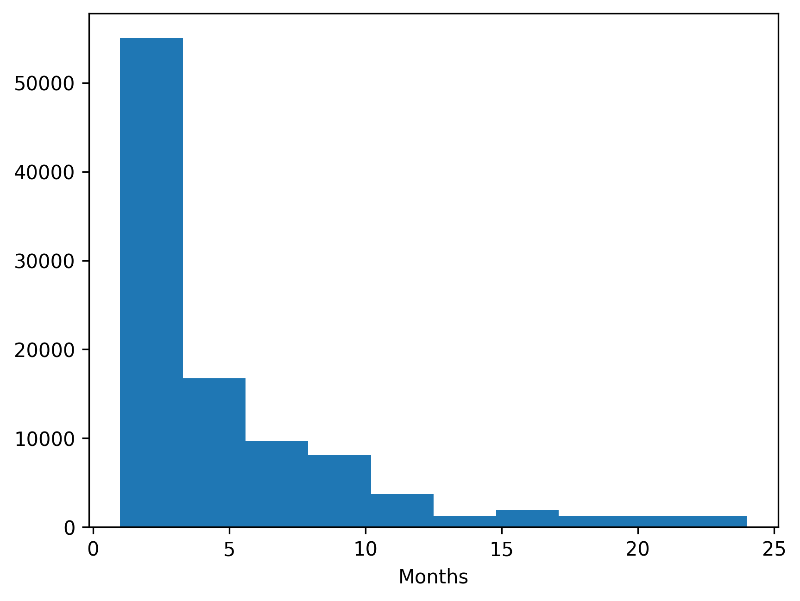{#suppfig-nhanes-predicted-month-difference}

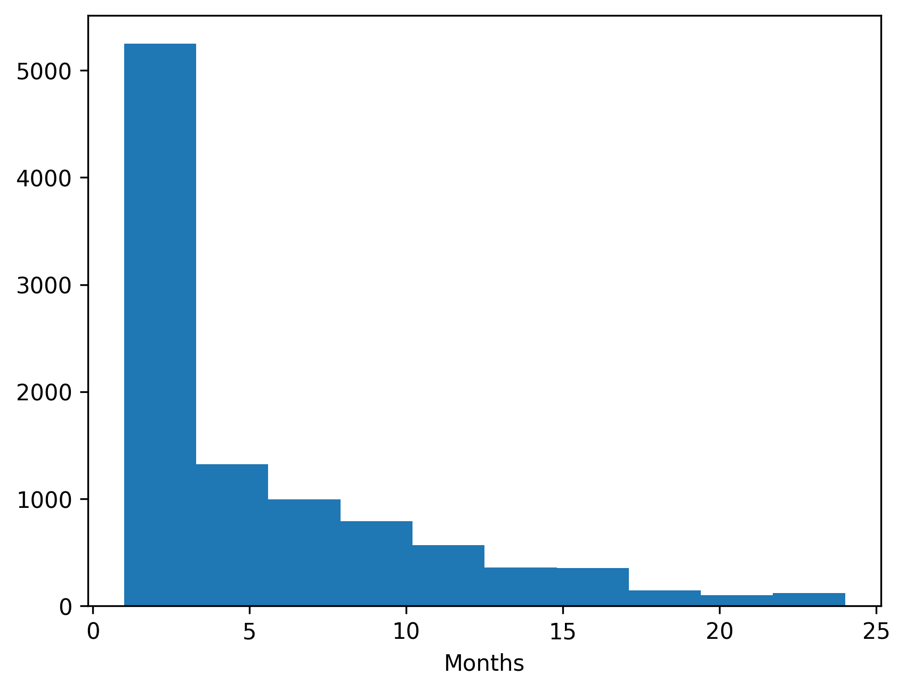{#suppfig-afc-month-difference}

Number of months between blood pressure measurements for 40-year-olds in (a) model simulation cohort and (b) PRIME registry
:::

At a measurement visit, simulated individuals with a blood pressure value corresponding to at least stage 1 hypertension may receive antihypertensive treatment. We predicted the probability of initiating antihypertensive treatment at a given measurement visit $P(A_{it} = 1)$ using a logistic regression as a function of patient age, sex, and systolic and diastolic blood pressure values: 
$$
\text{logit}(P(A_{it} = 1)) = \beta_0 + \beta_{1}X_{it} + \beta_2F_i + \beta_3Y_{it} + \beta_4Z_{it}.
$$

Our logistic regression was estimated using PRIME registry blood pressure observations with either systolic blood pressure of $\geq$ 130 mm Hg or diastolic blood pressure of $\geq$ 80 mm Hg prior to antihypertensive treatment. We identified a total of 10.7 million observations for 2.4 million patients and randomly sampled one million observations (n=404,908 patients) to fit the logistic regression. If a simulated individual did not initiate treatment at a measurement visit, we predicted the number of months until their next measurement and repeated this procedure until the simulated individual initiated treatment or died.

To validate rates of antihypertensive treatment exposure in our model, we estimated a Kaplan-Meier curve of individuals in the PRIME registry receiving antihypertensive treatment over time. Because we only had up to 6 years of follow-up in our data, we constructed a longer-term Kaplan-Meier curve using left-truncated observations. This approach allowed individuals entering observation at older ages to contribute person-time only after their entry age, thereby approximating a longer age-based treatment initiation curve. 

Assuming an index date of January 1, 2018, we followed cohorts of non-Hispanic Black and non-Hispanic white individuals aged 40, 46, 52, 58, 64, or 70 years who had not been exposed to antihypertensive treatment at the index date. We assumed the age of entry was the age of the age-specific cohort (e.g., 40 for the 40-year-old cohort). Exit age was defined as the minimum of the age at antihypertensive treatment exposure, age at last observed blood pressure measurement, and age at death simulated from age-sex-race-specific U.S. life tables. Observations were reweighted so that 50% of the adults were non-Hispanic Black and 50% were non-Hispanic white, matching the composition of our simulation cohort. The cumulative density of the Kaplan-Meier curve was compared with the fraction of alive adults in the detected and treated health system or discontinued health system states in our simulation model. Our model underestimated the cumulative incidence of antihypertensive treatment exposure observed in the PRIME registry. The high observed cumulative incidence in PRIME likely reflects individuals who initiated antihypertensive treatment for other health benefits beyond hypertension control, whereas our simulation model assumed that patients may initiate treatment only with elevated blood pressure values (@suppfig-cum-treatment-exposure).

::: {#suppfig-cum-treatment-exposure}
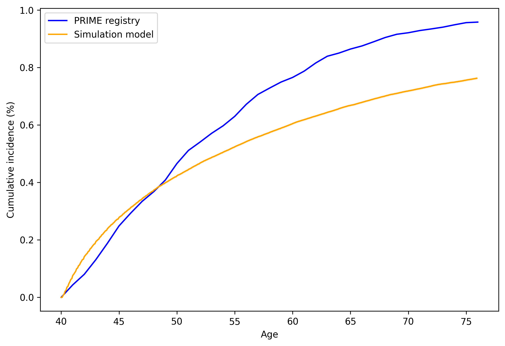

Comparing the cumulative incidence of antihypertensive treatment exposure between PRIME registry and simulation cohort
:::

We also compared the cumulative incidence of antihypertensive treatment in our model with published estimates from the Framingham Heart Study.[@vasan2002residual] The study reported the cumulative probability of receiving antihypertensive therapy from age 55 at 10, 15, 20, and 25 years of follow-up. As demonstrated in @suppfig-cum-treatment-exposure-external, our simulation model's cumulative incidence aligned closely with the published estimates at 15 and 20 years. However, the simulation model overestimated the cumulative incidence of treatment exposure at 10 years and underestimated it at 25 years. 

::: {#suppfig-cum-treatment-exposure-external}
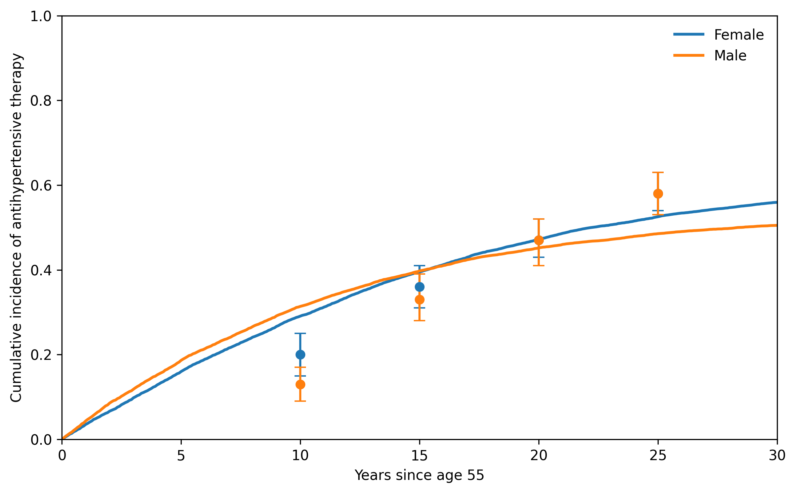

Comparing the cumulative incidence of antihypertensive treatment exposure in the Framingham Heart Study and simulation cohort
:::

In our secondary analysis, we incorporated census tract-level SDI in predicting the number of months until the next measurement visit:
$$
M_{i,t+1} = \beta_0 + \beta_{1}X_{it} + \beta_2F_i + \beta_3S_i + \beta_4Y_{it} + \beta_5Z_{it},
$$
and the probability of initiating antihypertensive treatment:
$$
\text{logit}(P(A_{it} = 1)) = \beta_0 + \beta_{1}X_{it} + \beta_2F_i + \beta_3S_i + \beta_4Y_{it} + \beta_5Z_{it}.
$$

### Validation analysis results {#sec-validation-results .appendix}

We validated the baseline simulation model against observed age-specific hypertension stage prevalence among individuals in the PRIME registry prior to antihypertensive medication use. In the baseline version of the model, we did not model health system utilization and thus did not simulate the effect of treatment on blood pressure. We sampled a validation cohort of 10,000 40-year-old patients from the PRIME registry. Demographic and clinical characteristics of our validation cohort are in @supptbl-validation-cohort-characteristics.

```{python}
#|include: false
#AFC demographics results 

hispanic_validation_prop = json.load(open(f"results/afc_validation/hispanic_prop.json"))
black_validation_prop = json.load(open(f"results/afc_validation/black_prop.json"))
white_validation_prop = json.load(open(f"results/afc_validation/white_prop.json"))
other_validation_prop = 1 - hispanic_validation_prop - black_validation_prop - white_validation_prop

female_validation_prop = json.load(open(f"results/afc_validation/female_prop.json"))

#hypertension stages 
normal_validation_prop = json.load(open(f"results/afc_validation/N_prop.json"))
elevated_validation_prop = json.load(open(f"results/afc_validation/E_prop.json"))
stage1_validation_prop = json.load(open(f"results/afc_validation/S1_prop.json"))
stage2_validation_prop = json.load(open(f"results/afc_validation/S2_prop.json"))

#continuous variables
sdi_validation_mean = json.load(open(f"results/afc_validation/sdi_mean.json"))
sdi_validation_std = json.load(open(f"results/afc_validation/sdi_std.json"))

systolic_validation_mean = json.load(open(f"results/afc_validation/systolic_mean.json"))
systolic_validation_std = json.load(open(f"results/afc_validation/systolic_std.json"))

diastolic_validation_mean = json.load(open(f"results/afc_validation/diastolic_mean.json"))
diastolic_validation_std = json.load(open(f"results/afc_validation/diastolic_std.json"))

death_age_mean = json.load(open(f"results/afc_validation/death_age_mean.json"))
death_age_se = json.load(open(f"results/afc_validation/death_age_se.json"))

h_death_age_mean = json.load(open(f"results/afc_validation/h_death_age_mean.json"))
h_death_age_se = json.load(open(f"results/afc_validation/h_death_age_se.json"))

nhb_death_age_mean = json.load(open(f"results/afc_validation/nhb_death_age_mean.json"))
nhb_death_age_se = json.load(open(f"results/afc_validation/nhb_death_age_se.json"))

nhw_death_age_mean = json.load(open(f"results/afc_validation/nhw_death_age_mean.json"))
nhw_death_age_se = json.load(open(f"results/afc_validation/nhw_death_age_se.json"))

sick_percent = json.load(open(f"results/afc_validation/sick_percent.json"))
sick_percent_se = json.load(open(f"results/afc_validation/sick_percent_se.json"))

years_sick_mean = json.load(open(f"results/afc_validation/years_sick_mean.json"))
years_sick_se = json.load(open(f"results/afc_validation/years_sick_se.json"))

```

::: {#supptbl-validation-cohort-characteristics}
| Categorical Variables |   | Category (%) |
|------------------------|------------------------|------------------------|
| Race/ethnicity | Hispanic | `{python} convert_to_percent(hispanic_validation_prop)`% |
|  | Non-Hispanic Black | `{python} convert_to_percent(black_validation_prop)`% |
|  | Non-Hispanic white | `{python} convert_to_percent(white_validation_prop)`% |
|  | Other race/ethnicity | `{python} convert_to_percent(other_validation_prop)`% |
| Sex | Female | `{python} convert_to_percent(female_validation_prop)`% |
| Initial hypertension stage | Normal | `{python} convert_to_percent(normal_validation_prop)`% |
|  | Elevated | `{python} convert_to_percent(elevated_validation_prop)`% |
|  | Stage 1 | `{python} convert_to_percent(stage1_validation_prop)`% |
|  | Stage 2 | `{python} convert_to_percent(stage2_validation_prop)`% |
| Continuous Variables |  | Mean \[SD\] |
| Census tract-level social deprivation index |  | `{python} round(sdi_validation_mean,1)` \[`{python} round(sdi_validation_std,1)`\] |
| Systolic blood pressure |  | `{python} round(systolic_validation_mean,1)` \[`{python} round(systolic_validation_std,1)`\] |
| Diastolic blood pressure |  | `{python} round(diastolic_validation_mean,1)` \[`{python} round(diastolic_validation_std,1)`\] |

Demographic and clinical characteristics of PRIME registry validation cohort (SD: standard deviation)
:::

The average life expectancy of our 40-year-old cohort was `{python} create_95_CI_mean_se(death_age_mean, death_age_se, "years")`. In @supptbl-validation-life-expectancy, we observed concordance between the average life expectancies computed by our simulation model and life expectancies by race and ethnicity reported in the 2021 U.S. life tables.[@arias2023united] 

::: {#supptbl-validation-life-expectancy}
| Race/Ethnicity | Validation Cohort, Mean [MCSE] | 2021 U.S. Life Table |
|------------------------|------------------------|------------------------|
| Hispanic | `{python} format_value_and_se([h_death_age_mean, h_death_age_se])` | 40.1 |
| Non-Hispanic Black | `{python} format_value_and_se([nhb_death_age_mean, nhb_death_age_se])` | 35.3 |
| Non-Hispanic white | `{python} format_value_and_se([nhw_death_age_mean,nhw_death_age_se])` | 38.9 |

Comparison of mean life expectancies in validation cohort with U.S. life table estimates by race/ethnicity (MCSE: Monte Carlo standard error)
:::

@suppfig-validation-results shows concordance between age-specific hypertension stage prevalence in the simulation cohort and the observed PRIME registry estimates, with 95% confidence intervals.

::: {#suppfig-validation-results layout-nrow="2"}
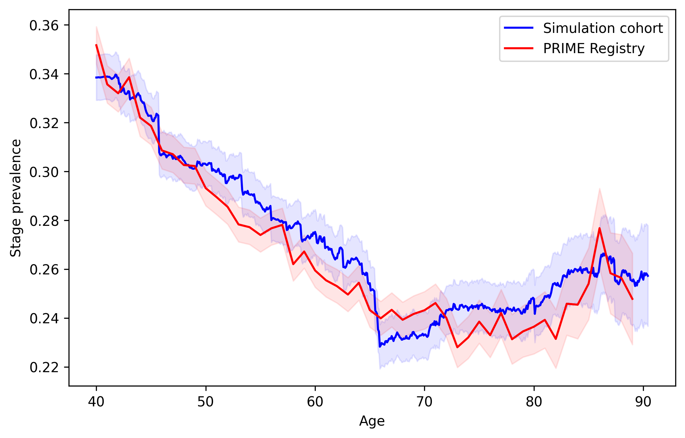{#fig-validation-normal}

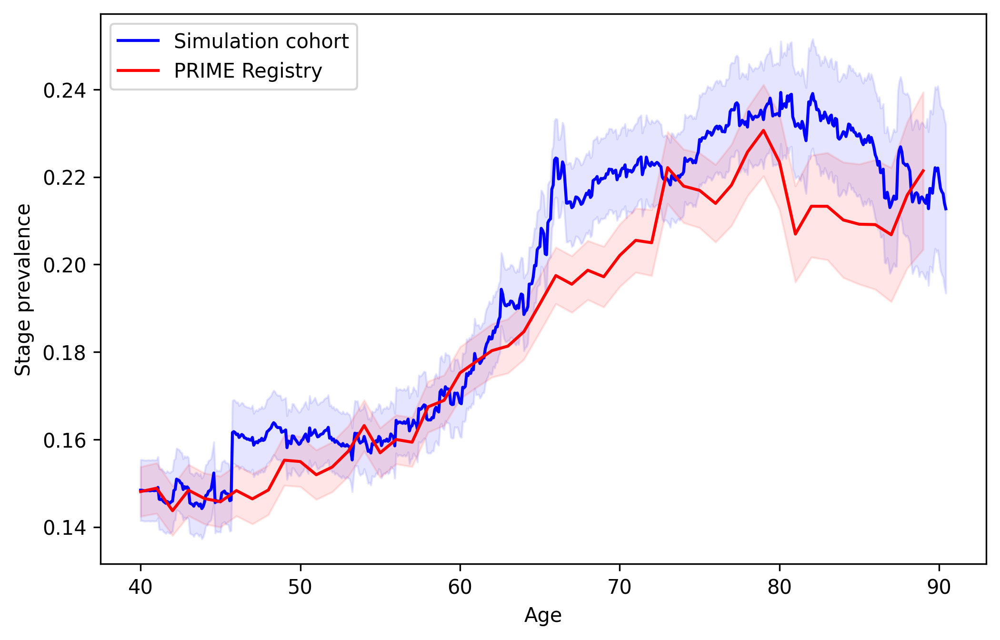{#fig-validation-elevated}

{#fig-validation-stage1}


Comparing the age-specific hypertension stage prevalence between the PRIME registry and simulation cohort: (a) Normal, (b) Elevated, (c) Stage 1, and (d) Stage 2 
:::

We also compared the lifetime incidence of hypertension from our simulation model with a previously published study, which estimated the lifetime risk of hypertension for Black women, Black men, white women, and white men [@chen2019lifetime]. Estimates and 95% confidence intervals from the published study are plotted with dots and vertical error bars. Our simulation model overestimated hypertension incidence among all groups, particularly among white women. 

::: {#suppfig-external-validation}
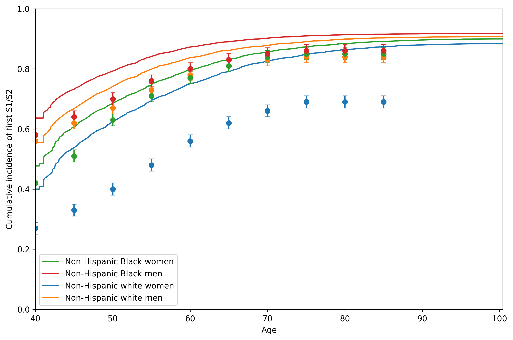

Cumulative incidence of hypertension (defined as systolic blood pressure $\geq$ 130 mm Hg or diastolic blood pressure $\geq$ 80 mm Hg) from our simulation model (lines) and published study (dots)
:::

### Secondary analysis with the social factors framework  {#sec-secondary-analysis .appendix}

Using a previously developed social factors framework,[@cusick2026novel] we modeled the impact of two social factors: health insurance status and census tract-level SDI, as demonstrated in the model diagram (@suppfig-model-diagram) and model transition probabilities (@supptbl-base-case). Sections @sec-sdi-assignment, @sec-mortality-insurance, @sec-transition-in-system, and @sec-out-of-system-BP describe additional changes to the model for our secondary analysis with the social factors framework.

::: {#suppfig-model-diagram}
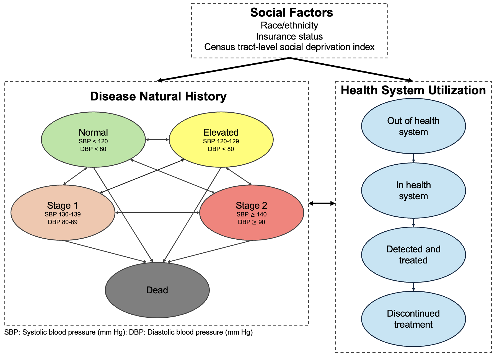

Model diagram of state-transition microsimulation model with social factors framework
:::

::: {#supptbl-base-case}
| Parameter | Dependencies | Data |
|------------------------|------------------------|------------------------|
| Simulation cohort | Age, sex, race/ethnicity, place for routine healthcare, insurance status, systolic and diastolic blood pressure values | NHANES [@CDC2018] |
| *Disease natural history parameters* |  |  |
| Systolic blood pressure values | Age, sex, SDI | PRIME [@phillips2017prime] |
| Diastolic blood pressure values | Age, sex, SDI | PRIME [@phillips2017prime] |
| Systolic and diastolic blood pressure increases | Health system status (out of health system) | NHANES [@CDC2018]  |
| Hypertension mortality risk (hazard ratio) | Systolic and diastolic blood pressure values | Hansen et al. [@hansen2005ambulatory] |
| Baseline mortality rates | Age, sex, race/ethnicity | 2021 U.S. life tables [@arias2023united] |
| Increased mortality risk from being uninsured (hazard ratio) |  | Wilper et al. [@wilper2009health] |
| *Health system utilization parameters* |  |  |
| Transition to in health system | Insurance status | NHANES [@CDC2018] |
| Transition to detected/treated | Age, sex, SDI, systolic and diastolic blood pressure values | PRIME [@phillips2017prime] |
| Transition to discontinued treatment | Insurance status, type of antihypertensive therapy | ALLHAT @antihypertensive2002major  |
| *Antihypertensive treatment parameters* |  |  |
| ACE inhibitor all-cause mortality (hazard ratio) |  | [@brenner2001effects; @ruggenenti1999renoprotective] |
| Antihypertensive monotherapy utilization | Race/ethnicity (when using treatment guidelines that vary by race/ethnicity) | Holt et al. [@holt2022differences] |
| Antihypertensive treatment blood pressure reductions | Race/ethnicity (if heterogeneous effects are assumed), type of antihypertensive treatment | ALLHAT [@antihypertensive2002major] |

Model parameter dependencies and data sources for secondary analysis (NHANES: National Health and Nutrition Examination Survey; SDI: social deprivation index, ALLHAT: Antihypertensive and Lipid-Lowering Treatment to Prevent Heart Attack Trial)
:::

### Census tract-level social deprivation index assignment {#sec-sdi-assignment .appendix}

Our simulation analysis required census tract-level SDI to predict model transition probabilities. However, the publicly available NHANES data used to create our simulation cohort did not include geocoded census tract information. To assign census tract-level SDI values to individuals in our cohort, we applied a Bayesian approach based on individual-level characteristics from NHANES. Individuals with a characteristic (e.g., being unemployed) were more likely to be assigned to a census tract with a higher percentage of individuals unemployed and younger than 65 years of age. The SDI metric comprises several area-level measures, including the percentages of individuals living in poverty, having less than 12 years of education, living in a single-parent household, residing in rented housing units, living in overcrowded housing units, lacking access to a car, and being unemployed and younger than 65 years of age.[@butler2013measures] NHANES provided individual-level data for all SDI components with the exception of car ownership.

```{python}
#|include: false
cohort_df = pd.read_csv('results/final_cohort/cohort_files/standard/sampled_cohort.csv')
SDI_mean = cohort_df['SDI'].mean()
SDI_std = cohort_df['SDI'].std()
SDI_insured_mean = cohort_df[cohort_df['insurance'] == 1]['SDI'].mean()
SDI_insured_std = cohort_df[cohort_df['insurance'] == 1]['SDI'].std()
SDI_uninsured_mean = cohort_df[cohort_df['insurance'] == 0]['SDI'].mean()
SDI_uninsured_std = cohort_df[cohort_df['insurance'] == 0]['SDI'].std()

##afc values
afc_sdi_mean = json.load(open(f"data_and_models/afc_outputs/social/afc_sdi_mean.json"))
afc_sdi_std = json.load(open(f"data_and_models/afc_outputs/social/afc_sdi_std.json"))
```

We obtained 2023 SDI data on 83,612 census tracts, which included population counts and the estimated fraction of individuals with each SDI component in the census tract. Using census tract population prevalence as the prior probability, we calculated each individual's posterior probability of belonging to each census tract based on  SDI-related characteristics observed in NHANES. Using these posterior probabilities, we sampled ten census tracts and assigned the average SDI value from the sampled census tracts as the individual's census tract-level SDI value. Averaging across multiple census tracts reduced the influence of any single extreme census tract-level SDI value.

In our simulation cohort, assigned census tract-level SDI values were on average `{python} round(SDI_mean,1)` with a standard deviation of `{python} round(SDI_std,1)`. Among those with insurance coverage, average assigned census tract-level SDI values were lower (`{python} round(SDI_insured_mean,1)` \[`{python} round(SDI_insured_std,1)`\]) compared to those without insurance coverage (`{python} round(SDI_uninsured_mean,1)` \[`{python} round(SDI_uninsured_std,1)`\]).

To ensure comparability with data from the PRIME registry, we validated our assigned census tract-level SDI values by comparing them to census tract-level SDI values of a randomly selected subset of 10,000 40-year-old individuals from the PRIME registry (5,000 non-Hispanic Black and 5,000 non-Hispanic white patients). Average census tract-level SDI was `{python} round(afc_sdi_mean,1)` with a standard deviation of `{python} round(afc_sdi_std,1)` in the PRIME registry. @suppfig-sdi-comparison shows histograms of census tract-level SDI values for our main simulation cohort and the randomly sampled subset from the PRIME registry. While census tract-level SDI values can vary over time, we assumed a single census tract-level SDI value per individual over their lifetime. The PRIME registry only has a single census tract-level SDI per individual and does not include historical census-tract data.

::: {#suppfig-sdi-comparison layout-ncol="2"}
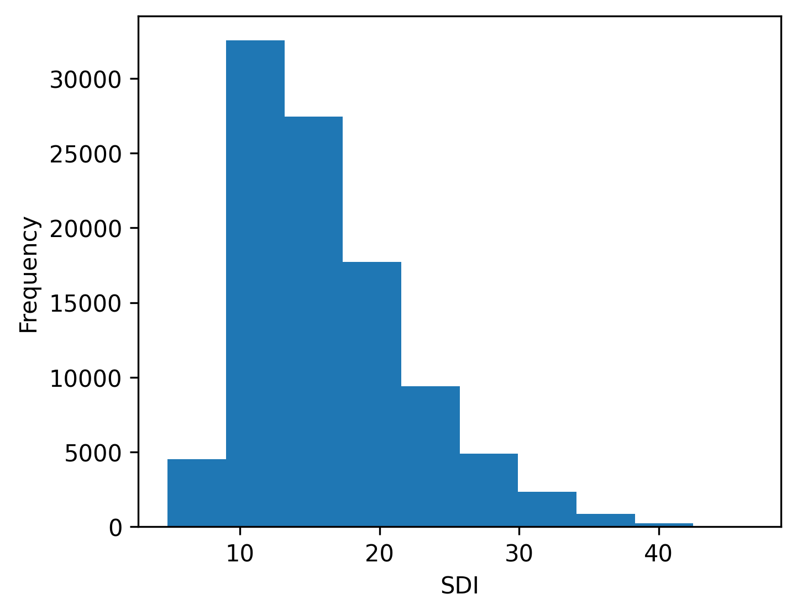{#fig-sdi-cohort}

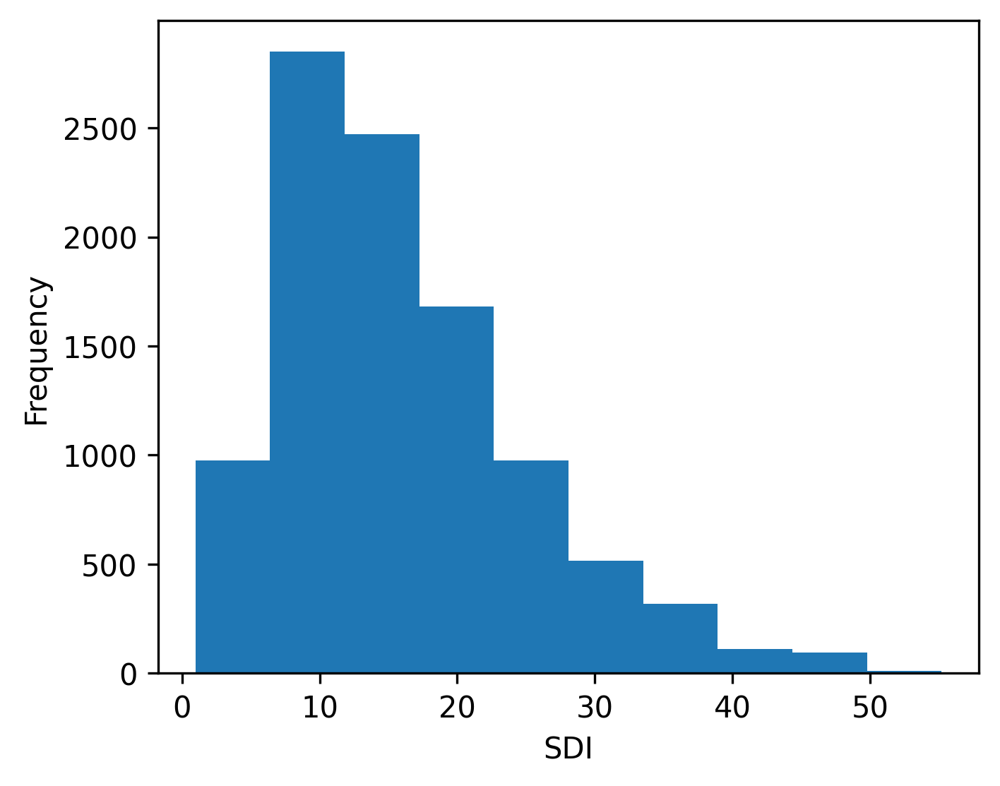{#fig-sdi-afc}

Comparison of census tract-level SDI distributions in (a) simulation cohort and (b) PRIME registry (SDI: social deprivation index)
:::

### Mortality adjustments by insurance status {#sec-mortality-insurance .appendix}

In our secondary analysis, we further adjusted baseline age-sex-racial/ethnic-group-specific mortality rates by health insurance status, based on evidence from prior studies.[@wilper2009health; @hill2024health] We assumed a constant race/ethnicity-specific prevalence of uninsured individuals and a hazard ratio for increased mortality risk among those uninsured. After age 65, we assumed all individuals received Medicare, and mortality rates returned to baseline values from the 2021 U.S. life tables.

### Entering the health system {#sec-transition-in-system .appendix}

Our simulation made the assumption that individuals without health insurance entered the health system, defined as having a routine place for healthcare, more slowly than those with health insurance. We applied a hazard ratio ($HR_{\text{IHS}}$), where $\text{IHS}$ refers to "in health system," to slow transition rates for simulated individuals without health insurance. The transition probability ($p_{IHS}$) and hazard ratio reduction ($HR_{\text{IHS}}$) were calibrated to match NHANES age-specific estimates of lacking a routine place for healthcare by insurance status. To obtain these NHANES estimates, we included 6,939 non-Hispanic Black and non-Hispanic white survey participants who were not currently treated with antihypertensive medication. In @suppfig-in-health-system-calibration, we compared the prevalence of the simulated cohort out of the health system (without a routine place of care) with NHANES age-specific estimates of having no place for routine healthcare by insurance status. The 95% confidence intervals for the NHANES age-specific estimates are shown as dots with error bars. Estimates for uninsured individuals after 65 are not included because the model assumes all individuals receive Medicare at age 65. Our simulation model reproduced the age-specific prevalence of not having routine access to healthcare in NHANES.

::: {#suppfig-in-health-system-calibration}
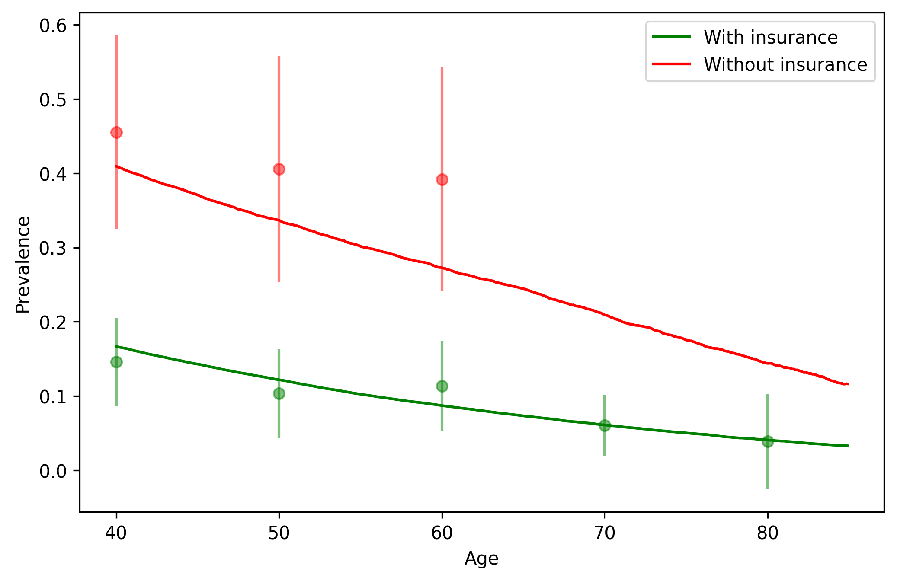

Age-specific prevalence of not having a routine place for healthcare by insurance status in our simulation cohort (lines) and NHANES (dots) (NHANES: National Health and Nutrition Examination Survey)
:::

### Blood pressure adjustments out of the health system {#sec-out-of-system-BP .appendix}

We assumed that not having a routine place for healthcare affected systolic and diastolic blood pressure values. From NHANES, we selected participants aged at least 40 years who self-reported not currently taking antihypertensive medication (n=3,837 survey participants). Similar to our approach in @sec-sys-dia-correlations, we estimated quantile regressions as a function of age, sex, no place for routine healthcare ($N_{i}$), and six SDI-related metrics ($S_{i}$) to predict systolic blood pressure values: 
$$
Y_{i} = \beta_0 + \beta_{1}X_{i} + \beta_2F_i + \beta_3N_i + \sum_{j = 1}^{k = 6}\beta_jS_{ij}
$$

and diastolic blood pressure values:
$$
Z_{i} = \beta_0 + \beta_{1}X_{i} + \beta_2F_i + \beta_3N_i + \sum_{j = 1}^{k = 6}\beta_jS_{ij}
$$

 Because census tract-level SDI is not captured in NHANES, we included individual-level data on SDI components, including whether an individual was living in poverty, had less than 12 years of education, lived in a single-parent household, resided in rented housing, lived in overcrowded housing units, and was unemployed and younger than 65 years of age.[@butler2013measures] We then leveraged the estimated coefficients for the indicator of having no place for routine healthcare from each of the quantile regressions in our simulations (@suppfig-no-place-bp-adjustments). During simulation, if a simulated individual was not in the health system, the estimated coefficient was added to the individual's current systolic or diastolic blood pressure value while they were out of the health system. 

::: {#suppfig-no-place-bp-adjustments layout-ncol="2"}
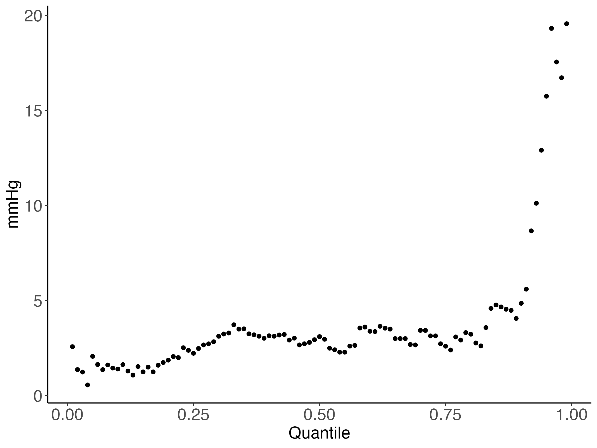{#suppfig-sbp-no-place}

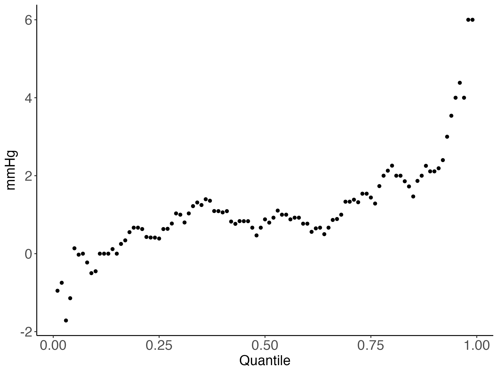{#suppfig-dbp-no-place}

Blood pressure adjustments by quantile for not having a routine place for healthcare: (a) systolic blood pressure and (b) diastolic blood pressure
:::

### Additional results {#sec-additional-main-results .appendix}

::: {#supptbl-standard-treatment-utilization}
| Group  | Race Adjustment |  | | No Race Adjustment |
|------------------|------------------|------------------|------------------|------------------|
|  | Thiazide Diuretic | ACE Inhibitor | Thiazide Diuretic | ACE Inhibitor|
| Non-Hispanic Black | `{python} convert_to_percent(standard_race_hetero_ra_dict['NHB']['cum_inc_treated_TD'][0])`% | `{python} convert_to_percent(standard_race_hetero_ra_dict['NHB']['cum_inc_treated'][0] - standard_race_hetero_ra_dict['NHB']['cum_inc_treated_TD'][0])`% | `{python} convert_to_percent(standard_race_hetero_nr_dict['NHB']['cum_inc_treated_TD'][0])`% | `{python} convert_to_percent(standard_race_hetero_nr_dict['NHB']['cum_inc_treated'][0] - standard_race_hetero_nr_dict['NHB']['cum_inc_treated_TD'][0])`% |
| Non-Hispanic white | `{python} convert_to_percent(standard_race_hetero_ra_dict['NHW']['cum_inc_treated_TD'][0])`% | `{python} convert_to_percent(standard_race_hetero_ra_dict['NHW']['cum_inc_treated'][0] - standard_race_hetero_ra_dict['NHW']['cum_inc_treated_TD'][0])`% | `{python} convert_to_percent(standard_race_hetero_nr_dict['NHW']['cum_inc_treated_TD'][0])`% | `{python} convert_to_percent(standard_race_hetero_nr_dict['NHW']['cum_inc_treated'][0] - standard_race_hetero_nr_dict['NHB']['cum_inc_treated_TD'][0])`% |
Cumulative incidence of antihypertensive treatment by class under antihypertensive treatment guidelines with and without race adjustment (ACE inhibitor: angiotensin-converting enzyme inhibitor)
:::

::: {#supptbl-standard-main-results}
| Outcome | Heterogeneous Treatment Effects |   | No Heterogeneous Treatment Effects |   |
|---------------|---------------|---------------|---------------|---------------|
|  | Race Adjustment | No Race Adjustment | Race Adjustment | No Race Adjustment |
| Cumulative incidence of hypertension stage 1 or 2 (%) | `{python} format_percent(standard_hetero_ra_dict['cum_inc_sick'])` | `{python} format_percent(standard_hetero_nr_dict['cum_inc_sick'])` | `{python} format_percent(standard_nohetero_ra_dict['cum_inc_sick'])` | `{python} format_percent(standard_nohetero_nr_dict['cum_inc_sick'])` |
| Years spent in stage 1 or 2 hypertension | `{python} format_value_and_se(standard_hetero_ra_dict['years_sick'])` | `{python} format_value_and_se(standard_hetero_nr_dict['years_sick'])` | `{python} format_value_and_se(standard_nohetero_ra_dict['years_sick'])` | `{python} format_value_and_se(standard_nohetero_nr_dict['years_sick'])` |
| Cumulative incidence of antihypertensive treatment | `{python} format_percent(standard_hetero_ra_dict['cum_inc_treated'])` | `{python} format_percent(standard_hetero_nr_dict['cum_inc_treated'])` | `{python} format_percent(standard_nohetero_ra_dict['cum_inc_treated'])` | `{python} format_percent(standard_nohetero_nr_dict['cum_inc_treated'])` |
| Years on antihypertensive treatment | `{python} format_value_and_se(standard_hetero_ra_dict['years_treated'])` | `{python} format_value_and_se(standard_hetero_nr_dict['years_treated'])` | `{python} format_value_and_se(standard_nohetero_ra_dict['years_treated'])` | `{python} format_value_and_se(standard_nohetero_nr_dict['years_treated'])` |
| Average age to initiate treatment | `{python} format_value_and_se(standard_hetero_ra_dict['treated_age'])` | `{python} format_value_and_se(standard_hetero_nr_dict['treated_age'])` | `{python} format_value_and_se(standard_nohetero_ra_dict['treated_age'])` | `{python} format_value_and_se(standard_nohetero_nr_dict['treated_age'])` |
| Years with uncontrolled hypertension | `{python} format_value_and_se(standard_hetero_ra_dict['years_sick_treated'])` | `{python} format_value_and_se(standard_hetero_nr_dict['years_sick_treated'])` | `{python} format_value_and_se(standard_nohetero_ra_dict['years_sick_treated'])` | `{python} format_value_and_se(standard_nohetero_nr_dict['years_sick_treated'])` |
| Years with controlled hypertension | `{python} format_value_and_se(standard_hetero_ra_dict['years_healthy_treated'])` | `{python} format_value_and_se(standard_hetero_nr_dict['years_healthy_treated'])` | `{python} format_value_and_se(standard_nohetero_ra_dict['years_healthy_treated'])` | `{python} format_value_and_se(standard_nohetero_nr_dict['years_healthy_treated'])` |
| Life expectancy | `{python} format_value_and_se(standard_hetero_ra_dict['years_to_death'])` | `{python} format_value_and_se(standard_hetero_nr_dict['years_to_death'])` | `{python} format_value_and_se(standard_nohetero_ra_dict['years_to_death'])` | `{python} format_value_and_se(standard_nohetero_nr_dict['years_to_death'])` |

Main outcomes comparing antihypertensive treatment guidelines with and without race adjustment (Mean [Monte Carlo standard error])
:::

### Additional results for secondary analysis {#sec-results-social-factors .appendix}

::: {#supptbl-sff-cohort}
|   |   | Non-Hispanic Black (N=50,000) | Non-Hispanic white (N=50,000) |
|------------------|------------------|------------------|------------------|
| Female (%) |  | `{python} convert_to_percent(demo_dict_NHB['female'][0])`% | `{python} convert_to_percent(demo_dict_NHW['female'][0])`% |
| With health insurance (%) |  | `{python} convert_to_percent(demo_dict_NHB['insurance'][0])`% | `{python} convert_to_percent(demo_dict_NHW['insurance'][0])`% |
| With place for routine healthcare (%) |  | `{python} convert_to_percent(demo_dict_NHB['place'][0])`% | `{python} convert_to_percent(demo_dict_NHW['place'][0])`% |
| Hypertension stage (%) | Normal | `{python} convert_to_percent(demo_dict_NHB['Normal'][0])`% | `{python} convert_to_percent(demo_dict_NHW['Normal'][0])`% |
|  | Elevated | `{python} convert_to_percent(demo_dict_NHB['Elevated'][0])`% | `{python} convert_to_percent(demo_dict_NHW['Elevated'][0])`% |
|  | Stage 1 | `{python} convert_to_percent(demo_dict_NHB['Stage 1'][0])`% | `{python} convert_to_percent(demo_dict_NHW['Stage 1'][0])`% |
|  | Stage 2 | `{python} convert_to_percent(demo_dict_NHB['Stage 2'][0])`% | `{python} convert_to_percent(demo_dict_NHW['Stage 2'][0])`% |
| Census tract-level SDI (mean \[SD\]) |  | `{python} format_value_and_se(demo_dict_NHB['SDI'], digits = 1)` | `{python} format_value_and_se(demo_dict_NHW['SDI'], digits = 1)` |
| Systolic blood pressure (mean \[SD\]) |  | `{python} format_value_and_se(demo_dict_NHB['systolic_bp'], digits = 1)` | `{python} format_value_and_se(demo_dict_NHW['systolic_bp'], digits = 1)` |
| Diastolic blood pressure (mean \[SD\]) |  | `{python} format_value_and_se(demo_dict_NHB['diastolic_bp'], digits = 1)` | `{python} format_value_and_se(demo_dict_NHW['diastolic_bp'], digits = 1)` |

Demographic and clinical characteristics of simulation cohort by race in secondary analysis (SD: standard deviation)
:::


::: {#supptbl-sff-main-results}
| Outcome | Heterogeneous Treatment Effects |   | No Heterogeneous Treatment Effects |   |
|---------------|---------------|---------------|---------------|---------------|
|  | Race Adjustment | No Race Adjustment | Race Adjustment | No Race Adjustment |
| Cumulative incidence of hypertension stage 1 or 2 (%) | `{python} format_percent(hetero_ra_dict['cum_inc_sick'])` | `{python} format_percent(hetero_nr_dict['cum_inc_sick'])` | `{python} format_percent(nohetero_ra_dict['cum_inc_sick'])` | `{python} format_percent(nohetero_nr_dict['cum_inc_sick'])` |
| Years spent in stage 1 or 2 hypertension | `{python} format_value_and_se(hetero_ra_dict['years_sick'])` | `{python} format_value_and_se(hetero_nr_dict['years_sick'])` | `{python} format_value_and_se(nohetero_ra_dict['years_sick'])` | `{python} format_value_and_se(nohetero_nr_dict['years_sick'])` |
| Cumulative incidence of antihypertensive treatment | `{python} format_percent(hetero_ra_dict['cum_inc_treated'])` | `{python} format_percent(hetero_nr_dict['cum_inc_treated'])` | `{python} format_percent(nohetero_ra_dict['cum_inc_treated'])` | `{python} format_percent(nohetero_nr_dict['cum_inc_treated'])` |
| Years on antihypertensive treatment | `{python} format_value_and_se(hetero_ra_dict['years_treated'])` | `{python} format_value_and_se(hetero_nr_dict['years_treated'])` | `{python} format_value_and_se(nohetero_ra_dict['years_treated'])` | `{python} format_value_and_se(nohetero_nr_dict['years_treated'])` |
| Average age to initiate treatment | `{python} format_value_and_se(hetero_ra_dict['treated_age'])` | `{python} format_value_and_se(hetero_nr_dict['treated_age'])` | `{python} format_value_and_se(nohetero_ra_dict['treated_age'])` | `{python} format_value_and_se(nohetero_nr_dict['treated_age'])` |
| Years with uncontrolled hypertension | `{python} format_value_and_se(hetero_ra_dict['years_sick_treated'])` | `{python} format_value_and_se(hetero_nr_dict['years_sick_treated'])` | `{python} format_value_and_se(nohetero_ra_dict['years_sick_treated'])` | `{python} format_value_and_se(nohetero_nr_dict['years_sick_treated'])` |
| Years with controlled hypertension | `{python} format_value_and_se(hetero_ra_dict['years_healthy_treated'])` | `{python} format_value_and_se(hetero_nr_dict['years_healthy_treated'])` | `{python} format_value_and_se(nohetero_ra_dict['years_healthy_treated'])` | `{python} format_value_and_se(nohetero_nr_dict['years_healthy_treated'])` |
| Life expectancy | `{python} format_value_and_se(hetero_ra_dict['years_to_death'])` | `{python} format_value_and_se(hetero_nr_dict['years_to_death'])` | `{python} format_value_and_se(nohetero_ra_dict['years_to_death'])` | `{python} format_value_and_se(nohetero_nr_dict['years_to_death'])` |

Main outcomes comparing antihypertensive treatment guidelines with and without race adjustment in secondary analysis (Mean [Monte Carlo standard error])
:::


::: {#suppfig-sff-results-race layout-nrow="2"}
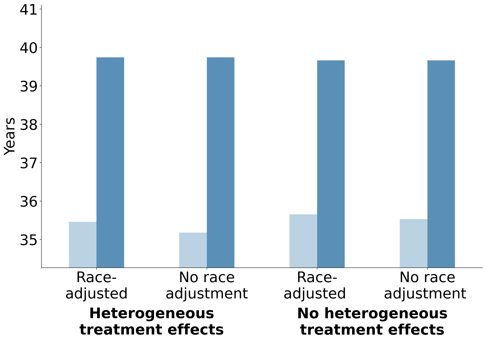{#suppfig-second-le}

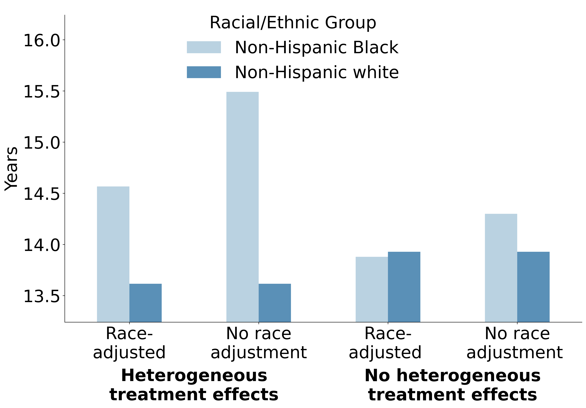{#suppfig-second-sick}

{#suppfig-second-treated}

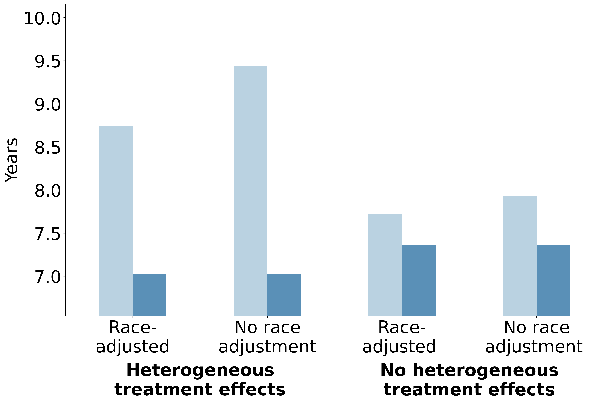{#suppfig-second-sick-treated}

Comparing antihypertensive treatment guidelines with and without race adjustment for non-Hispanic Black and non-Hispanic white adults (secondary analysis). Outcomes: (a) life expectancy, (b) years with stage 1 or 2 hypertension, (c) years on antihypertensive treatment, (d) years with uncontrolled hypertension
:::


::: {#supptbl-sff-results-by-race}
| Outcome | Group | Heterogeneous Treatment Effects |   | No Heterogeneous Treatment Effects |   |
|------------|------------|------------|------------|------------|------------|
|  |  | Race Adjustment | No Race Adjustment | Race Adjustment | No Race Adjustment |
| Years spent in stage 1 or 2 hypertension | Non-Hispanic Black | `{python} format_value_and_se(race_hetero_ra_dict['NHB']['years_sick'])` | `{python} format_value_and_se(race_hetero_nr_dict['NHB']['years_sick'])` | `{python} format_value_and_se(race_nohetero_ra_dict['NHB']['years_sick'])` | `{python} format_value_and_se(race_nohetero_nr_dict['NHB']['years_sick'])` |
|  | Non-Hispanic white | `{python} format_value_and_se(race_hetero_ra_dict['NHW']['years_sick'])` | `{python} format_value_and_se(race_hetero_nr_dict['NHW']['years_sick'])` | `{python} format_value_and_se(race_nohetero_ra_dict['NHW']['years_sick'])` | `{python} format_value_and_se(race_nohetero_nr_dict['NHW']['years_sick'])` |
|  | Difference | `{python} format_value_and_se(race_hetero_ra_dict['Difference']['years_sick'])` | `{python} format_value_and_se(race_hetero_nr_dict['Difference']['years_sick'])` | `{python} format_value_and_se(race_nohetero_ra_dict['Difference']['years_sick'])` | `{python} format_value_and_se(race_nohetero_nr_dict['Difference']['years_sick'])` |
| Years on antihypertensive treatment | Non-Hispanic Black | `{python} format_value_and_se(race_hetero_ra_dict['NHB']['years_treated'])` | `{python} format_value_and_se(race_hetero_nr_dict['NHB']['years_treated'])` | `{python} format_value_and_se(race_nohetero_ra_dict['NHB']['years_treated'])` | `{python} format_value_and_se(race_nohetero_nr_dict['NHB']['years_treated'])` |
|  | Non-Hispanic white | `{python} format_value_and_se(race_hetero_ra_dict['NHW']['years_treated'])` | `{python} format_value_and_se(race_hetero_nr_dict['NHW']['years_treated'])` | `{python} format_value_and_se(race_nohetero_ra_dict['NHW']['years_treated'])` | `{python} format_value_and_se(race_nohetero_nr_dict['NHW']['years_treated'])` |
|  | Difference | `{python} format_value_and_se(race_hetero_ra_dict['Difference']['years_treated'])` | `{python} format_value_and_se(race_hetero_nr_dict['Difference']['years_treated'])` | `{python} format_value_and_se(race_nohetero_ra_dict['Difference']['years_treated'])` | `{python} format_value_and_se(race_nohetero_nr_dict['Difference']['years_treated'])` |
| Years with uncontrolled hypertension | Non-Hispanic Black | `{python} format_value_and_se(race_hetero_ra_dict['NHB']['years_sick_treated'])` | `{python} format_value_and_se(race_hetero_nr_dict['NHB']['years_sick_treated'])` | `{python} format_value_and_se(race_nohetero_ra_dict['NHB']['years_sick_treated'])` | `{python} format_value_and_se(race_nohetero_nr_dict['NHB']['years_sick_treated'])` |
|  | Non-Hispanic white | `{python} format_value_and_se(race_hetero_ra_dict['NHW']['years_sick_treated'])` | `{python} format_value_and_se(race_hetero_nr_dict['NHW']['years_sick_treated'])` | `{python} format_value_and_se(race_nohetero_ra_dict['NHW']['years_sick_treated'])` | `{python} format_value_and_se(race_nohetero_nr_dict['NHW']['years_sick_treated'])` |
|  | Difference | `{python} format_value_and_se(race_hetero_ra_dict['Difference']['years_sick_treated'])` | `{python} format_value_and_se(race_hetero_nr_dict['Difference']['years_sick_treated'])` | `{python} format_value_and_se(race_nohetero_ra_dict['Difference']['years_sick_treated'])` | `{python} format_value_and_se(race_nohetero_nr_dict['Difference']['years_sick_treated'])` |
| Life expectancy | Non-Hispanic Black | `{python} format_value_and_se(race_hetero_ra_dict['NHB']['years_to_death'])` | `{python} format_value_and_se(race_hetero_nr_dict['NHB']['years_to_death'])` | `{python} format_value_and_se(race_nohetero_ra_dict['NHB']['years_to_death'])` | `{python} format_value_and_se(race_nohetero_nr_dict['NHB']['years_to_death'])` |
|  | Non-Hispanic white | `{python} format_value_and_se(race_hetero_ra_dict['NHW']['years_to_death'])` | `{python} format_value_and_se(race_hetero_nr_dict['NHW']['years_to_death'])` | `{python} format_value_and_se(race_nohetero_ra_dict['NHW']['years_to_death'])` | `{python} format_value_and_se(race_nohetero_nr_dict['NHW']['years_to_death'])` |
|  | Difference | `{python} format_value_and_se(race_hetero_ra_dict['Difference']['years_to_death'])` | `{python} format_value_and_se(race_hetero_nr_dict['Difference']['years_to_death'])` | `{python} format_value_and_se(race_nohetero_ra_dict['Difference']['years_to_death'])` | `{python} format_value_and_se(race_nohetero_nr_dict['Difference']['years_to_death'])` |

Main outcomes for non-Hispanic Black and non-Hispanic white adults comparing antihypertensive treatment guidelines with and without race adjustment in secondary analysis (Mean [Monte Carlo standard error])
:::


::: {#supptbl-main-results-by-race-insurance}

| Outcome | Racial/Ethnic Group | Insurance | Heterogeneous Treatment Effects |   | No Heterogeneous Treatment Effects |   |
|-----------|-----------|-----------|-----------|-----------|-----------|-----------|
|  |  |  | Race Adjustment | No Race adjustment | Race Adjustment | No Race Adjustment |
| Years spent in stage 1 or 2 hypertension | Non-Hispanic Black | Yes | `{python} format_value_and_se(race_ins_hetero_ra_dict[(1,'NHB')]['years_sick'])` | `{python} format_value_and_se(race_ins_hetero_nr_dict[(1,'NHB')]['years_sick'])` | `{python} format_value_and_se(race_ins_nohetero_ra_dict[(1,'NHB')]['years_sick'])` | `{python} format_value_and_se(race_ins_nohetero_nr_dict[(1,'NHB')]['years_sick'])` |
|  |  | No | `{python} format_value_and_se(race_ins_hetero_ra_dict[(0,'NHB')]['years_sick'])` | `{python} format_value_and_se(race_ins_hetero_nr_dict[(0,'NHB')]['years_sick'])` | `{python} format_value_and_se(race_ins_nohetero_ra_dict[(0,'NHB')]['years_sick'])` | `{python} format_value_and_se(race_ins_nohetero_nr_dict[(0,'NHB')]['years_sick'])` |
|  | Non-Hispanic white | Yes | `{python} format_value_and_se(race_ins_hetero_ra_dict[(1,'NHW')]['years_sick'])` | `{python} format_value_and_se(race_ins_hetero_nr_dict[(1,'NHW')]['years_sick'])` | `{python} format_value_and_se(race_ins_nohetero_ra_dict[(1,'NHW')]['years_sick'])` | `{python} format_value_and_se(race_ins_nohetero_nr_dict[(1,'NHW')]['years_sick'])` |
|  |  | No | `{python} format_value_and_se(race_ins_hetero_ra_dict[(0,'NHW')]['years_sick'])` | `{python} format_value_and_se(race_ins_hetero_nr_dict[(0,'NHW')]['years_sick'])` | `{python} format_value_and_se(race_ins_nohetero_ra_dict[(0,'NHW')]['years_sick'])` | `{python} format_value_and_se(race_ins_nohetero_nr_dict[(0,'NHW')]['years_sick'])` |
| Years on antihypertensive treatment | Non-Hispanic Black | Yes | `{python} format_value_and_se(race_ins_hetero_ra_dict[(1,'NHB')]['years_treated'])` | `{python} format_value_and_se(race_ins_hetero_nr_dict[(1,'NHB')]['years_treated'])` | `{python} format_value_and_se(race_ins_nohetero_ra_dict[(1,'NHB')]['years_treated'])` | `{python} format_value_and_se(race_ins_nohetero_nr_dict[(1,'NHB')]['years_treated'])` |
|  |  | No | `{python} format_value_and_se(race_ins_hetero_ra_dict[(0,'NHB')]['years_treated'])` | `{python} format_value_and_se(race_ins_hetero_nr_dict[(0,'NHB')]['years_treated'])` | `{python} format_value_and_se(race_ins_nohetero_ra_dict[(0,'NHB')]['years_treated'])` | `{python} format_value_and_se(race_ins_nohetero_nr_dict[(0,'NHB')]['years_treated'])` |
|  | Non-Hispanic white | Yes | `{python} format_value_and_se(race_ins_hetero_ra_dict[(1,'NHW')]['years_treated'])` | `{python} format_value_and_se(race_ins_hetero_nr_dict[(1,'NHW')]['years_treated'])` | `{python} format_value_and_se(race_ins_nohetero_ra_dict[(1,'NHW')]['years_treated'])` | `{python} format_value_and_se(race_ins_nohetero_nr_dict[(1,'NHW')]['years_treated'])` |
|  |  | No | `{python} format_value_and_se(race_ins_hetero_ra_dict[(0,'NHW')]['years_treated'])` | `{python} format_value_and_se(race_ins_hetero_nr_dict[(0,'NHW')]['years_treated'])` | `{python} format_value_and_se(race_ins_nohetero_ra_dict[(0,'NHW')]['years_treated'])` | `{python} format_value_and_se(race_ins_nohetero_nr_dict[(0,'NHW')]['years_treated'])` |
| Years with uncontrolled hypertension | Non-Hispanic Black | Yes | `{python} format_value_and_se(race_ins_hetero_ra_dict[(1,'NHB')]['years_sick_treated'])` | `{python} format_value_and_se(race_ins_hetero_nr_dict[(1,'NHB')]['years_sick_treated'])` | `{python} format_value_and_se(race_ins_nohetero_ra_dict[(1,'NHB')]['years_sick_treated'])` | `{python} format_value_and_se(race_ins_nohetero_nr_dict[(1,'NHB')]['years_sick_treated'])` |
|  |  | No | `{python} format_value_and_se(race_ins_hetero_ra_dict[(0,'NHB')]['years_sick_treated'])` | `{python} format_value_and_se(race_ins_hetero_nr_dict[(0,'NHB')]['years_sick_treated'])` | `{python} format_value_and_se(race_ins_nohetero_ra_dict[(0,'NHB')]['years_sick_treated'])` | `{python} format_value_and_se(race_ins_nohetero_nr_dict[(0,'NHB')]['years_sick_treated'])` |
|  | Non-Hispanic white | Yes | `{python} format_value_and_se(race_ins_hetero_ra_dict[(1,'NHW')]['years_sick_treated'])` | `{python} format_value_and_se(race_ins_hetero_nr_dict[(1,'NHW')]['years_sick_treated'])` | `{python} format_value_and_se(race_ins_nohetero_ra_dict[(1,'NHW')]['years_sick_treated'])` | `{python} format_value_and_se(race_ins_nohetero_nr_dict[(1,'NHW')]['years_sick_treated'])` |
|  |  | No | `{python} format_value_and_se(race_ins_hetero_ra_dict[(0,'NHW')]['years_sick_treated'])` | `{python} format_value_and_se(race_ins_hetero_nr_dict[(0,'NHW')]['years_sick_treated'])` | `{python} format_value_and_se(race_ins_nohetero_ra_dict[(0,'NHW')]['years_sick_treated'])` | `{python} format_value_and_se(race_ins_nohetero_nr_dict[(0,'NHW')]['years_sick_treated'])` |
| Life expectancy | Non-Hispanic Black | Yes | `{python} format_value_and_se(race_ins_hetero_ra_dict[(1,'NHB')]['years_to_death'])` | `{python} format_value_and_se(race_ins_hetero_nr_dict[(1,'NHB')]['years_to_death'])` | `{python} format_value_and_se(race_ins_nohetero_ra_dict[(1,'NHB')]['years_to_death'])` | `{python} format_value_and_se(race_ins_nohetero_nr_dict[(1,'NHB')]['years_to_death'])` |
|  |  | No | `{python} format_value_and_se(race_ins_hetero_ra_dict[(0,'NHB')]['years_to_death'])` | `{python} format_value_and_se(race_ins_hetero_nr_dict[(0,'NHB')]['years_to_death'])` | `{python} format_value_and_se(race_ins_nohetero_ra_dict[(0,'NHB')]['years_to_death'])` | `{python} format_value_and_se(race_ins_nohetero_nr_dict[(0,'NHB')]['years_to_death'])` |
|  | Non-Hispanic white | Yes | `{python} format_value_and_se(race_ins_hetero_ra_dict[(1,'NHW')]['years_to_death'])` | `{python} format_value_and_se(race_ins_hetero_nr_dict[(1,'NHW')]['years_to_death'])` | `{python} format_value_and_se(race_ins_nohetero_ra_dict[(1,'NHW')]['years_to_death'])` | `{python} format_value_and_se(race_ins_nohetero_nr_dict[(1,'NHW')]['years_to_death'])` |
|  |  | No | `{python} format_value_and_se(race_ins_hetero_ra_dict[(0,'NHW')]['years_to_death'])` | `{python} format_value_and_se(race_ins_hetero_nr_dict[(0,'NHW')]['years_to_death'])` | `{python} format_value_and_se(race_ins_nohetero_ra_dict[(0,'NHW')]['years_to_death'])` | `{python} format_value_and_se(race_ins_nohetero_nr_dict[(0,'NHW')]['years_to_death'])` |

Main outcomes for non-Hispanic Black and non-Hispanic white adults comparing antihypertensive treatment guidelines with and without race adjustment by insurance status in secondary analysis (Mean [Monte Carlo standard error])
:::